# Electrical Drawing Studio 取扱説明書

## 1. はじめに

### 1.1 このツールについて

Electrical Drawing Studio は、ブラウザで動作する単一 HTML ファイルの電気図面作図ツールです。
リレー回路図（ラダー図）、端子接続図、PLC入出力図、機器配置図といった
設備の電気図面を、部品パレットから部品を置いて配線するだけで作図できます。

AutoCAD Electrical のような電気図面作成の考え方を参考にしながら、次の点を重視しています。

- **インストール不要**: `index.html` を1つ配るだけで、どのPCでもすぐ使えます。
- **初心者でも迷わない**: 左の部品パレットから置く→つなぐ→印刷、の3ステップが基本です。
- **自動化で手間を減らす**: 線番の採番、部品タグ、コイルと接点の相互参照、
  各種帳票（部品表・端子台プラン表など）を自動で作れます。

### 1.2 対象読者と学習の進め方

本書は「電気図面のCADを初めて使う方」を想定しています。おすすめの読み進め方は次のとおりです。

1. まず **26章「チュートリアル: はじめてのリレー回路図」** を、実際に手を動かしながら一度通してください。
   基本操作（ページ作成→部品配置→配線→線番→印刷）が15分程度で身につきます。
2. 作図中に分からない操作が出てきたら、目次から該当する章を引いてください。
   各章は「何ができるか→手順→補足」の順で書かれています。
3. 用語が分からないときは **27章「用語集」**、うまく動かないときは
   **28章「困ったときは（逆引き）」** を参照してください。

### 1.3 本書の表記

本書では次の記法を使います。

- `「◯◯」` : 画面上のボタン名・メニュー名・入力欄の名前です。
- `機能メニューの「◯◯」` : 左パネルの機能メニュー（プルダウン）から選ぶ項目です（§3.3）。
- 💡 **ヒント** : 知っていると便利な補足です。読み飛ばしても操作はできます。
- ⚠️ **注意** : 守らないとデータが消える・図面が崩れるなど、重要な注意点です。

### 1.4 動作環境

- 推奨ブラウザ: Google Chrome または Microsoft Edge の最新版。
- インターネット接続: 不要です（すべての機能がオフラインで動きます）。
- インストール・管理者権限: 不要です。

## 2. 起動方法

1. `index.html` をダブルクリックするか、ブラウザへドラッグして開きます。
2. 画面中央に A4 縦の図枠付き図面が表示されます。
3. 左側に部品パレット、右側にページ設定と選択要素の編集欄が表示されます。

起動できたかは、上部に濃紺のツールバー、中央に白い用紙、左右に操作パネルが
表示されていることで確認できます。空ページ中央の「はじめかた」は操作ガイドで、印刷には出ません。

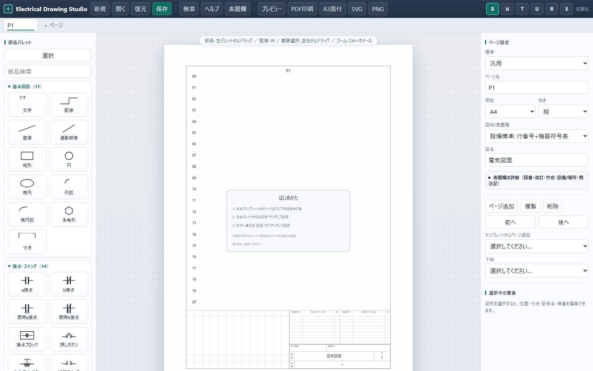{: .shot-full}

メール添付や GitHub からダウンロードした場合も、`index.html` をブラウザで開くだけで使用できます。

> 💡 **ヒント:** 初回起動時は空のページに薄く操作ガイドが表示されます。
> 部品を置くと自動的に消えるので、まずはガイドに従って部品を1つ置いてみてください。

> ⚠️ **注意:** 作業内容はブラウザ内に自動保存されますが、恒久的な保存には
> 上部の「保存」（JSONファイル）を使ってください（§16）。ブラウザの履歴データを
> 消去すると自動保存も消えます。

## 3. 画面構成

画面は「上部ツールバー」「ページタブ」「左パネル」「中央キャンバス」「右パネル」の
5つの主要領域でできています。図3-1の色枠と番号は、以降の説明で使う領域名を示しています。
操作の結果や次の手順は、上部ツールバー右端のステータス表示に出ます。

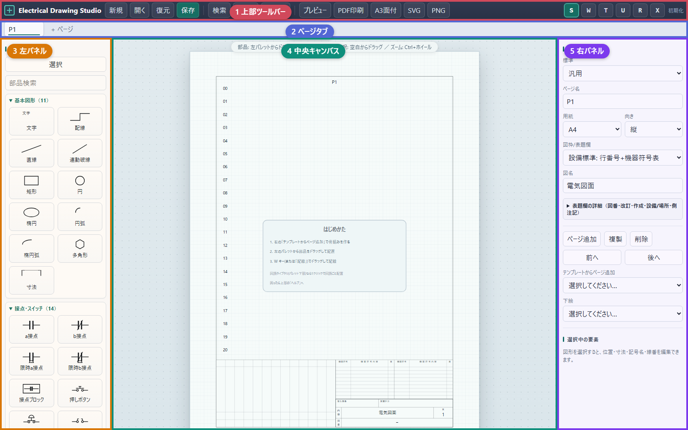{: .shot-full}

> 💡 **ヒント:** 迷ったら上部ツールバー右端のステータス表示を見てください。
> 「◯◯を配置しました」「◯◯を選択してください」など、次にすべきことが表示されます。

### 3.1 上部ツールバー

- 新規: 現在の内容を破棄して新しい図面を作成します。
- 開く: 保存済み JSON ファイルを読み込みます。
- 復元: ブラウザ内の自動保存データを復元します。
- 保存: 現在の図面を JSON 形式で保存します。
- 検索: 線番、タグ、文字、属性メモを検索・一括置換します。
- ヘルプ: はじめの5ステップとキーボードショートカットを表示します。
- 表題欄: 全ページの表題欄を一括更新します。
- PDF印刷: 全ページを通常のページ単位で印刷します。
- A3面付: A3 縦に 2 ページずつ面付けして印刷します。
- SVG: 現在ページを SVG で出力します。
- PNG: 現在ページを PNG で出力します。

### 3.2 ページタブ

画面上部のタブでページを切り替えます。

- `+ ページ`: 新しいページを追加します。
- 各ページタブ: タブ表示ではそのページへ切り替えます。並べて表示では、そのページへスクロールして
  編集対象にします（§4.4b）。
- タブをダブルクリックするとページ名を変更できます。

### 3.3 左パネル

左パネルには部品パレット、表示設定、配線・レイヤ設定、自動処理・ツールがあります。

部品はドラッグして用紙上へ配置できます。クリックで部品配置モードに入り、用紙上をクリックして配置することもできます。

パレット下部の**「回路ライブラリ」**には、自己保持回路・起動停止回路・タイマ遅延回路・
ランプ表示行・ブザー警報行・非常停止行の**組み立て済み回路**が入っています。
1クリックで配線・接点・コイルごと配置され、タグ（CR1等）を右パネルで実番号に変えるだけで使えます。

部品パレットは「基本図形」「接点・スイッチ」「コイル・表示」などの**カテゴリ**に分かれており、
見出しをクリックすると開閉できます。パレット先頭には**「最近使用」**が自動で並び、
直前に置いた部品をすぐ再配置できます。部品検索に入力するとカテゴリを横断して絞り込め、
**Enterキーで先頭候補がそのまま配置モード**になります（キーボードだけで配置まで完了）。
空のページには「はじめかた」ガイドカードが表示されます（印刷には出ません）。

よく使う「線番採番」「監査」はボタンのまま、その他の機能は**機能メニュー**（プルダウン）に
グループ分けして集約しています。線番・部品タグの書式（%S-%N等）は、その上の
**「採番の書式設定」**の折りたたみ内にあります（普段は閉じたままで使えます）。

- 自動処理: 端子番号 / 部品タグ採番 / 接続点生成 / 指定回転 / 配線順序 / ラング追加 / 行挿入・行削除
- 一括生成: ラング回路 / 非常停止チェーン / 電源投入回路 / ブレーキ・整流回路 / 縦配線列 /
  横配線行 / ツイストペア / モータ分岐回路 / PLCユニット / 盤レイアウト連携
- 一覧・管理: プロジェクト管理（ブラウザ内保存） / 端子台エディタ / 部品タグ規則 / 配線種別管理 / レイヤ管理 / 部品カタログ / ユーザー部品管理
- 電気設計管理: ケーブル・芯線エディタ / 設置場所・接続ビュー / PLCモジュールDB / 盤レイアウト双方向同期
- 帳票・確認: クロスリファレンス / 帳票CSV出力 / 図面要素一覧 / 帳票表挿入 / BOM
- 取込・出力: 端子CSV / PLC CSV / DXF取込 / DXF出力（現在ページ・全ページ） / 標準パック出力・取込

以降の章で「機能メニューの「◯◯」」とある場合は、このプルダウンから選択してください
（選択すると即実行され、メニューは元に戻ります）。

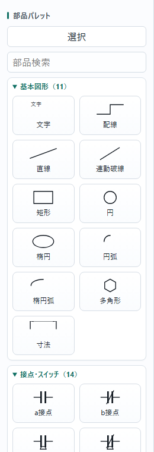{: .shot-panel}

左パネルの「表示」では、次の設定を操作できます。

- ページ表示: タブ（1ページずつ）／並べて表示（横・縦）を切り替えます（§4.4b）。
- ズーム: 0.8〜24倍。スライダー／縮小・拡大ボタン／`Ctrl+ホイール`／
  キーボードの `+`・`−`・`0`（全体表示）で変更します。
- 標準／全体表示: 原寸または作業領域に収まる倍率で表示します。
- グリッド／スナップ: グリッド間隔と、グリッド・端点への吸着を設定します。
- 下絵出力: 下絵をPDF／SVG／PNGへ含めるかを切り替えます。

拡大・縮小は高倍率でも操作しやすいよう比例ステップ（1クリックで約1.25倍）です。

### 3.4 中央キャンバス

図面を作図する領域です。キャンバス上部には**操作ヒント**が常時表示され、
「いま選んでいるツールで何ができるか／次に何をすればよいか」を案内します
（例: 配線中は「ドラッグで作図・Escで戻る」、部品選択中は「Ctrl+D複製・Delete削除」）。

- 部品をクリックすると選択できます。
- 選択した部品はドラッグで移動できます。
- 配線、直線、矢印はドラッグで始点と終点を指定します。

### 3.5 右パネル

右パネルにはページ設定と選択中要素の編集欄があります。

ページを選択している状態では、用紙、向き、図枠、図番、図名、作成者、日付、設備コード、場所コードなどを編集できます。

図形や記号を選択すると、位置、寸法、回転、ラベル、線番、属性メモなどを編集できます。

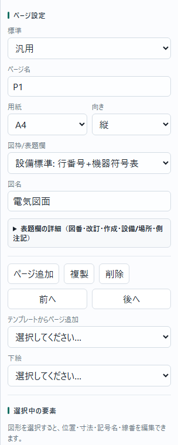{: .shot-panel}

## 4. ページ操作

### 4.1 ページ追加

右パネルの「ページ追加」を押すと、現在の用紙設定を引き継いだ新しいページが追加されます。

### 4.2 ページ複製（アドレス一括オフセット対応）

「複製」を押すとダイアログが開き、**複製数**と**1枚ごとのオフセット**を指定できます。

オフセットを指定すると、複製ページの線番・タグ・ラベル・PLCピン文字・ページ名の
**末尾番号へ一括加算**されます。接頭辞と桁数は保持され、X/Y等の16進アドレスは16進で、
CR1等の10進番号は10進で加算されます。

例: オフセット16・複製2枚 → `X060`のページから `X070`・`X080` のページが一度に作れます
（設備の入出力回路のような同型ページの量産向け）。オフセット0なら従来どおりの単純複製です。

### 4.3 ページ削除

「削除」を押すと、現在ページを削除します。最後の 1 ページは削除できません。

### 4.4 ページ順変更

「前へ」「後へ」でページ順を変更できます。「ページ順」へ移動先の番号を直接入力すると、任意の位置へ一度に移動できます。PDF印刷、A3面付、帳票のページ順に反映されます。

並べて表示中は、各ページ見出しの◀▶（縦のときは▲▼）でも並び順を変更できます（§4.4b）。

ページ名は既定では図面上部に表示されません。必要な図面だけ、右パネルの「図面上部にページ名を表示」をONにすると、上部中央へ表示できます。

### 4.4b ページ表示モード（タブ／並べて表示）

左パネル「表示」の **「ページ表示」** で、ページの表示方法を切り替えられます。

- **タブ（1ページずつ）**: 既定。上部タブで切り替えながら、1ページずつ表示・編集します。
- **並べて表示（横）**: 全ページを**横一列**に並べ、どのページも直接編集できます。
- **並べて表示（縦）**: 全ページを**縦一列**に並べます。

並べて表示では、次のように操作します。

- ページをクリックすると、そのページが現在ページ（編集対象／アクティブページ）へ自動的に切り替わります。
  アクティブページは**緑の枠と緑の見出し**で強調され、上部タブの選択も連動します。
- 部品の配置、配線、ダブルクリック編集、右クリックメニューなどを、どのページにも直接実行できます。
  操作を始めたページがアクティブページになります。
- 各ページ見出しの **◀▶**（縦のときは **▲▼**）で、ページの並び順をその場で入れ替えられます。
  タブ順、PDF印刷、A3面付、帳票のページ順も連動します。
- 上部タブをクリックすると、そのページへスクロールして編集対象にします。

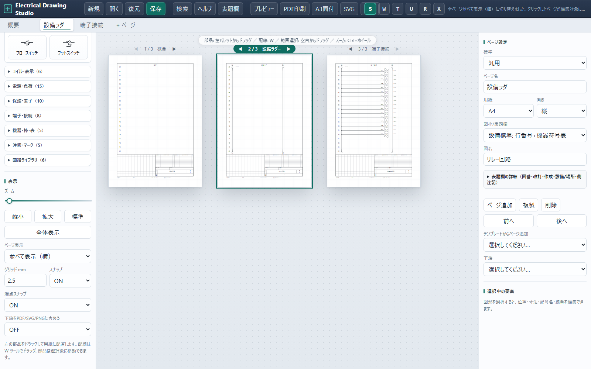{: .shot-full}

ページをまたぐ比較・転記や、図面全体の見通し確認に便利です。ページ数が多い図面
（目安10ページ超）では表示が重くなることがあるため、通常の作図はタブ表示、確認時は
並べて表示、という使い分けをおすすめします。

> 💡 **表示と保存・出力:** ページ表示モードと並び方向は図面JSONへ保存されます。
> 表示モードはPDF印刷、A3面付、SVG／PNG／DXF出力の内容には影響しません。
> 「現在ページ」を出力する機能では、緑枠のアクティブページが対象です。

### 4.5 テンプレートページ

右パネルの「テンプレートからページ追加」プルダウンで、作図開始用のページを追加できます。

- 設備ラダー: 行番号付き図枠+P1/N1レール+極性マークのラダーページ。レール名や本数を指定できます。
- AC電源回路（受電・分岐）: AC200V三相またはAC100V単相の受電から、ELB、表示灯、
  盤内照明・ファン・コンセント・REC/GOT送りなどのCP分岐までをまとめて配置します。
  200V時は変圧器（100VA/500VA/なし）も選択できます。
- AC電源回路（モータ）: サーボアンプ（1軸/2軸）またはインバータのモータ回路を追加します。
  サーボ時はエンコーダ送り・ブレーキ回路・リレー回路、インバータ時はサーマル・整流器・
  CC-Linkツイストペアまで生成します。
- DC電源回路: CP、スイッチング電源、N1/P0/P24/N24/Gの送り回路を追加します。
- PLC電源回路: PLCベースとスロット構成、P0A/N1/P1/P3/P3Mの電源・接点分岐を追加します。
- セーフティリレー回路: セーフティリレーユニット、2チャンネル非常停止ループ、
  安全出力、モニタリレー、ユニット電源を追加します。
- PLC入出力回路: 種別（入力/出力）と開始アドレスを選ぶと16進連番で一括生成します。
  入力は接点+配線+端子+ユニット列（右置き）、出力はユニット列（左置き)+端子+配線+コイルの構成です。
  モジュールプリセット（入力16点X000など）を選ぶと各欄が自動入力され、
  「現在値をプリセット保存」で自分のモジュール構成をプロジェクトへ登録できます
  （標準パックにも含まれます）。
- 端子接続図: レール+横配線+端子小円+ユニット列端子台の端子接続図ページ。
- インターロック接続: 盤枠（実線）と相手設備枠（一点鎖線）の間に、境界端子付きの
  送り（→発信元）/受け（←受信先）信号行を生成します。矢印ラベルに信号名を入れると
  相手ページとのクロス参照・頁注記が働きます。
- ラダー（汎用）: 左右母線とラングを持つ従来形式のラダーページ。
- 目次: 基本図枠に、見出し「図面目次」と編集可能な目次表（要素）を配置したページ。
- 機器配置: 機器配置図ページ。

「設備ラダー」を選ぶと、図4-2の設定画面が開きます。通常は左レール `P1`、右レール `N1`、
電源注記 `(DC24V)` の既定値で開始します。左レールを複数置く場合は、名称をカンマ区切りで入力します。

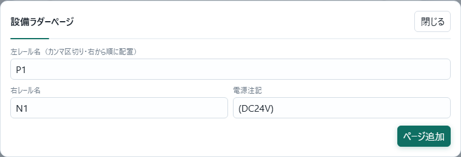{: .shot-wide}

### 4.6 下絵画像

右パネルの「下絵」プルダウンから操作します。「下絵画像を挿入」で PNG、JPEG、WebP、SVG 画像を現在ページへ挿入できます。

下絵画像は薄い透明度で用紙内に配置され、初期状態ではロックされます。位置やサイズを合わせたい場合は、下絵を選択して「ロック解除」を押してから右パネルで X、Y、幅、高さ、回転、透明度を調整します。

ロック中の下絵は、通常のクリックや範囲選択の邪魔にならないようにしています。下絵を調整したいときは、下絵プルダウンの「下絵を選択」を実行してからロック解除してください。

図4-3のように、下絵を選択すると右パネルに画像範囲と透明度が表示されます。
位置合わせ中は透明度を20〜40%程度にすると、下絵と新しく描いた線を見分けやすくなります。

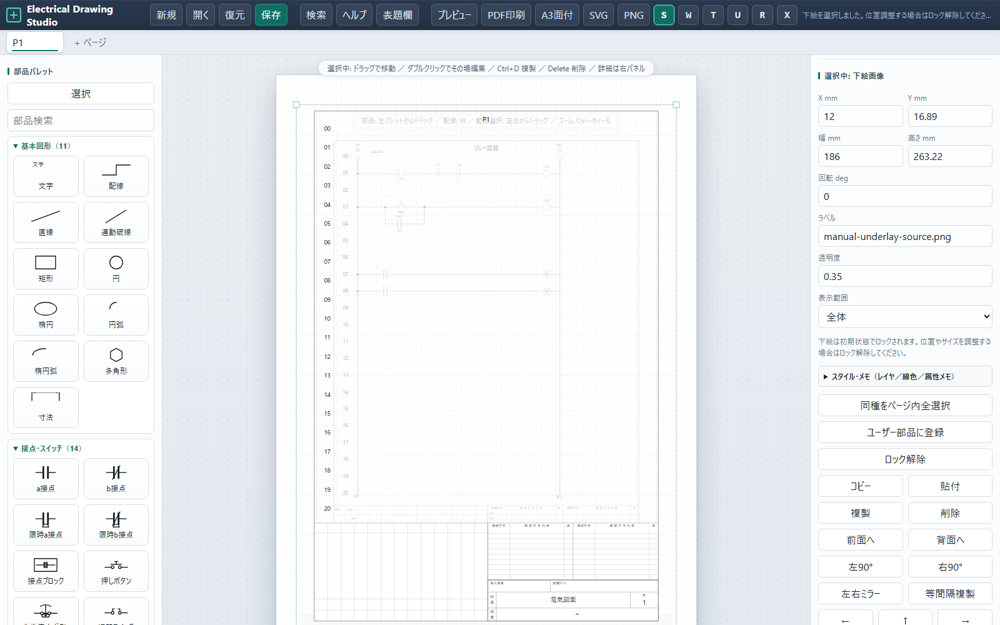{: .shot-full}

表示範囲は、全体、上半分、下半分、左半分、右半分から選べます。通常の下絵画像を手動で合わせる場合に使用します。

下絵プルダウンの「2面下絵ページを作成」を実行すると、1 枚のA3スキャン画像から A4 縦ページを 2 枚作成します。A4図面2枚をA3へ面付けしたスキャンを想定し、画像を90度時計回りに回転してから左半分と右半分をそれぞれA4ページとして配置します。

複数の画像をまとめて選択することもできます。その場合は、各画像ごとに上半分ページと下半分ページが連続して追加されます。

下絵はスキャン画像をなぞって作図するための補助要素です。帳票とクロス参照には含まれません。

既定では下絵はPDF印刷、SVG出力、PNG出力に含まれません。確認用として下絵も一緒に出したい場合は、左パネルの「下絵をPDF/SVG/PNGに含める」をONにします。DXFには下絵画像を埋め込みません。

PDFスキャンを下絵にする場合は、必要なページをPNGまたはJPEG画像に変換してから読み込んでください。

## 5. 用紙と図枠

### 5.1 用紙サイズ

右パネルで以下を選択できます。

- A4
- A3

### 5.2 用紙向き

- 縦
- 横

### 5.3 図枠/表題欄

以下の図枠パターンを選択できます。**新規ページの既定は「設備標準」**
（行番号00〜20・クロス参照表・機器符号表つき。設備の回路図面と同じ様式）です。

- 設備標準: 行番号+機器符号表（既定）
- 基本: 右下表題欄
- 詳細: 右下表題欄 + 改訂欄
- 側面表題欄
- 目次/表紙: 大型表欄
- 枠線のみ

表題欄の図名、設備、図番、改訂、作成、日付はページごとに保持されます。
「基本」の日付も独立した罫線セル内に表示され、`20○○/○○/○○` の形式でも枠内に収まります。
新規ページの日付は作成当日のローカル日付で自動入力されます。日付欄は固定値ではなく、
右パネルの「日付」から任意の日付や社内書式へ変更できます。

位置の目安には、設備標準図枠の**行番号**（ピッチ9.5mm）とグリッドを使います
（用紙外周の座標目盛は設備様式に存在しないため設けていません）。

> 💡 **表題欄のカスタマイズ:** 「基本」「詳細」表題欄の罫線・欄の配置は、
> 機能メニューの「**表題欄レイアウト編集（JSON）**」で自社様式に変更できます。
> 変更したレイアウトは図面JSONと一緒に保存され、**標準パック**（§18）にも同梱されるため、
> チームで同じ表題欄様式を配れます。「既定に戻す」でいつでも元に戻せます
> （設備標準図枠は寸法固定のため対象外です）。

## 6. 部品配置

この章では、図面に部品（接点・コイル・端子などの記号）を置く方法を説明します。
部品を置く→つなぐ（9章の配線）→編集する（7章）が作図の基本サイクルです。

### 6.1 基本操作

部品の置き方は2通りあります。どちらでも結果は同じです。

**方法1: ドラッグで置く（おすすめ）**

1. 左パネルの部品パレットから、置きたい部品をマウスで**ドラッグ**します。
2. 用紙上の置きたい位置でマウスボタンを**離す**と配置されます。

**方法2: クリックで置く（同じ部品を連続で置くとき）**

1. パレットの部品を**クリック**します（配置モードに入り、部品が緑枠になります）。
2. 用紙上を**クリック**するたびに、その位置へ部品が置かれます。
3. 終わったら `Esc` キーまたはパレットの「選択」を押して配置モードを抜けます。

置いた後の操作:

3. 配置した部品を**クリック**すると選択できます（緑の枠が付きます）。
4. 右パネルで位置、寸法、ラベル、属性を編集します（7章）。

> 💡 **ヒント:** 部品は自動的にグリッド（方眼）へ吸着するので、だいたいの位置で
> 離しても整列します。接点やコイルなどのインライン部品を既存の配線の上へ置くと、
> 配線が自動で分割されて部品が線の中へ割り込みます（配線を引き直す必要はありません）。

> 💡 **ヒント:** 間違えて置いたら `Ctrl+Z`（元に戻す）または `Delete`（選択して削除）です。

部品数が多い場合は、部品パレット上部の「部品検索」に部品名や種別を入力すると、候補を絞り込めます。例: `端子`、`PLC`、`wire`

### 6.2 配置できる主な部品

- 文字
- 配線
- 直線
- 連動破線
- 矩形
- 円 ／ 楕円（楕円は幅・高さ違いの円として配置されます。円も幅と高さを変えると楕円になります）
- 円弧 ／ 楕円弧（右パネルの開始角/終了角で弧の範囲を指定。幅≠高さで楕円弧。開始=終了で全周。
  **弧の両端点は移動時に配線・端子・直線の端点へ吸着**します。
  DXFへは円弧=ARC、楕円弧=折れ線近似で出力されます）
- 多角形（クリック位置を中心に正六角形で配置。右パネルで辺数3〜12または外接半径を変更すると、
  中心位置を保ったまま**正多角形へ即時更新**されます。更新ボタンを押す必要はありません。
  **頂点追加/削除**ができ、図面上の頂点ハンドルをドラッグして自由な形にできます。
  **頂点は端子・配線・直線の端点へ吸着**します。
  「**分解（直線にばらす）**」で辺ごとの独立した直線に変換でき、個別に編集・削除できます）
- 雲マーク（改訂範囲などを囲む雲形の枠。角ハンドルで大きさを変えられます）
- 改訂三角（改訂番号入りの△。配置時の番号は改訂履歴の最新改訂記号が既定になり、
  ダブルクリックまたは右パネルのラベル欄で変更できます。雲マークとセットで改訂範囲の明示に使います）
- 端子
- 端子台
- 端子配線セット
- a接点
- b接点
- 限時a接点／限時b接点（タイマ接点。限時記号つき、タイマコイルとのクロス参照対応）
- 接点ブロック
- 押しボタン
- 非常停止ボタン（既定は一般形のキノコ+b接点。JIS C 0617形、縦連結2/3接点、
  旧来のひねり解除環つき設備標準形、バー押込式へ切替できます）
- 切替スイッチ
- リミットスイッチ
- コイル
- ヒューズ
- 遮断器
- ランプ
- ブザー
- 計器(V/A)（円+文字。ラベルに V や A を入力）
- ベル
- リアクトル（山形コブ3個）
- ヒータ（箱+斜線）
- バッテリ／整流器（単体）／変流器(CT)／避雷器
- 断路器／コンセント／回転灯
- トランジスタ（NPN/PNP。C/Eピンは中心線から±2.5mmでグリッド整合）
- 論理ゲート（AND/OR/NOT/NAND/NOR/XOR。IEC/JIS矩形式「&」「≥1」「1＋否定丸」
  「&＋否定丸」「≥1＋否定丸」「=1」。入出力ピンは2.5mm格子整合）
- フォトカプラ（箱内LED＋受光素子。入出力4ピン）
- ソレノイド弁
- センサ
- 電源
- トランス
- 接地
- モータ
- ファン
- 抵抗
- コンデンサ
- ダイオード
- サーマルリレー
- サーマル素子
- 圧力スイッチ
- フロートスイッチ／温度スイッチ／フロースイッチ／フットスイッチ
- ポジション表示
- 極性マーク
- 機器箱
- 設備枠
- 場所枠
- PLC/I-O
- コネクタ
- ケーブルマーカー
- ケーブル束
- 端子箱
- 表
- 信号矢印
- 寸法（2点をドラッグで指定。水平/垂直を自動判定し実寸mmを表示。ラベルで上書き可、オフセット調整可）
- 接続点

表部品は、右パネルで行数、列数、列幅、行高、表文字サイズ、セル文字を編集できます。列幅と行高はカンマ区切りで指定します。未入力の場合は等幅・等高になります。

## 7. 選択後の編集

この章では、置いた部品の選び方と、右パネルでの編集方法を説明します。

部品を選択すると、右パネルが自動で「選択中の要素」セクションまでスクロールし、
編集欄（シンボルデザイン・タグなど）がすぐ見える位置に表示されます。
また、シンボルは線の上だけでなく**外形の少し外側まで**クリックで掴めます
（設備枠・矩形などの枠系は、内側の部品を選べるように枠線付近のみが対象です）。

選択のしかた（まとめ）:

- **1つ選ぶ**: 部品をクリック。
- **複数選ぶ**: `Shift` を押しながらクリックで追加/解除。
- **範囲で選ぶ**: 用紙の空白部分からドラッグ（枠に重なった要素をまとめて選択）。
- **選択を外す**: 空白をクリック、または `Esc`。

選択ツール（`S` / `V`）で端子や部品の接続点をクリックしても配線作図には切り替わらず、
そのまま選択・移動できます。端子から配線を始める場合は、先に `W` で配線ツールを選びます。

図形を選択すると、右パネルに編集欄が表示されます。

図7-1ではコイル `CR1` を選択しています。キャンバス上の選択枠で対象を確認し、
右パネルを上から順に「形状・タグ」→「電気属性」→「表示位置」と確認すると、編集箇所を見失いません。

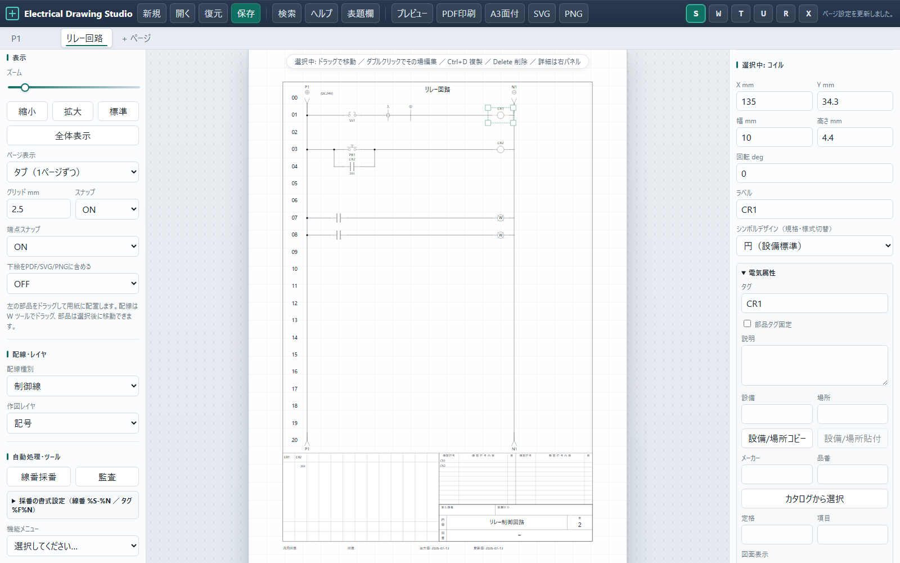{: .shot-full}

使用頻度の低い項目は折りたたみにまとめています: ページ設定の「表題欄の詳細」、
選択パネルの「スタイル・メモ（レイヤ／線色／属性メモ）」は見出しクリックで開閉できます。

用紙の空白部分をドラッグすると範囲選択枠が表示され、枠に重なった要素をまとめて選択できます。Shift を押しながら空白ドラッグすると、現在の選択に範囲内の要素を追加できます。下絵画像は範囲選択に含めません。

### 7.1 位置と寸法

- X mm
- Y mm
- 幅 mm
- 高さ mm
- 回転 deg

数値を入力して正確に配置できます。

幅と高さを持つ単一要素を選択すると、選択枠の四隅にハンドルが表示されます。角ハンドルをドラッグすると、図面上で直接サイズを変更できます。配線、矢印、接続点、ロック中の要素は角ハンドルでリサイズできません。

端子、接点、コイル、ヒューズ、遮断器、ランプ、ブザー、接地、モータ、ファン、抵抗、ダイオードなどの主要シンボルは、パレットから配置した時点で作図用の既定寸法になります。配置直後に寸法調整ボタンを押す運用は不要です。

> 💡 **右クリックメニュー:** 要素を**右クリック**すると、その場編集／コピー／複製／削除／
> 回転／ミラー／ロック／同種を全選択／（コイル・接点なら）参照先へ移動、を
> その場で実行できます。空白を右クリックすると「貼付」「全体表示」が出ます。

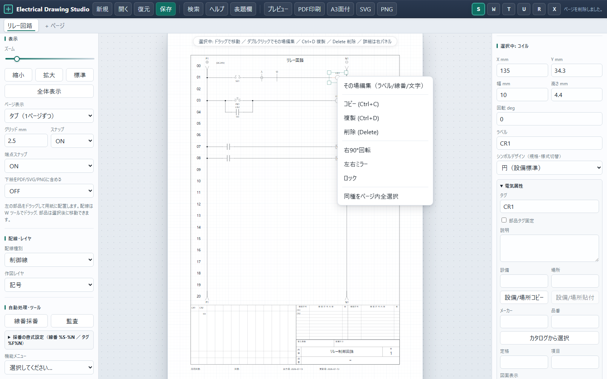{: .shot-full}

> 💡 **ヒント:** 要素を**ダブルクリック**すると、図面上でその場編集できます
> （部品=ラベル、配線=線番、文字=本文）。`Enter` 確定、`Esc` 取消、
> `Tab` で同種の次の要素へ連続入力（§9.3）。

### 7.2 ラベルと線番

部品にはラベル、配線には線番を入力できます。

部品を選択すると、ラベル位置X/Yとラベル文字サイズを右パネルで調整できます。ラベル位置Yは、正の値ほど上へ移動します。

各要素の「文字スタイル」では、その要素が表示する文字のサイズと太字を変更できます。配線では線番の文字サイズと太字、文字部品では本文の文字サイズと太字を設定できます。

文字部品では複数行のテキストを入力できます。横位置（左・中央・右）と縦位置（上・中央・下）を組み合わせ、左上・上中央・右上・左中央・中央・右中央・左下・下中央・右下へ配置できます。文字、機器箱の端子名、端子台の端子名などは入力中にフォーカスが外れず、そのまま連続入力できます。

位置欄のY座標は、値が大きいほど図面の上へ移動する上向き正の座標です。X座標は従来どおり右向き正です。電気部品の「接続点 X/Y」は外形左上ではなく第1配線接続点の座標を示し、値を変更すると第1接続点が指定座標へ移動します。機器箱・端子箱・PLCなど複数接続点を持つ部品は、各接続点の間隔を2.5mm単位にそろえます。

#### 接点方向

a接点、b接点、押しボタンを選択すると、右パネルで「接点方向」を選べます。

「横向き標準」は、横配線上へ置きやすい小型の接点記号です。新しく配置するa接点、b接点、押しボタンはこの形が既定です。

「縦配線上の回転配置用」は、縦配線上へ回転して配置したい場合の形です。まず横向き標準で配置し、必要に応じて右パネルの回転や接点方向を調整します。

接点ブロックは、点線枠の中に小型接点を持つ部品です。配線上をクリックすると配線中心に合わせて配置され、配線は左右端子位置で自動分割されます。選択後、右パネルの「内部接点」で a接点 / b接点を切り替えられます。

ヒューズ、遮断器、コイル、ランプ、ブザー、接地、モータ、抵抗、ダイオードは、実図面の部品密度に合わせて新規配置時の既定寸法を小さめにしています。これらの主要シンボルは配線上へ置きやすいインライン記号として表示され、DXF出力でも同じ線分構成で出力されます。

ヒューズと遮断器は、右パネルの「保護部品方向」で横配線用/縦配線用を切り替えられます。縦配線上をクリックして配置した場合は、縦配線用の寸法へ自動で切り替わり、配線は上下端子位置で自動分割されます。

ランプを選択すると、右パネルの「ランプ形状」で「丸形パイロット」と「筒形表示灯」を切り替えられます。ブザーを選択すると、「ブザー形状」で「ホーン」と「スピーカー」を切り替えられます。筒形表示灯やホーン形ブザーを作図する場合は、この形状を切り替えてから回転や位置を合わせます。

単体端子は、新規配置時は丸端子として配置されます。右パネルの「端子形状」で「丸」と「角」を切り替えられます。

### 7.3 属性メモ

すべての要素に属性メモを入力できます。

属性メモは検索対象になり、帳票 CSV にも出力されます。

### 7.4 電気属性

端子、端子台、接点、コイル、ランプ、PLC/I-O、機器箱などの電気部品には、右パネルで電気属性を入力できます。

- タグ
- 説明
- 設備
- 場所
- メーカー
- 品番
- 定格
- 項目

「部品タグ固定」を ON にすると、部品タグの自動採番を実行しても、その部品のタグとラベルは上書きされません。既に手入力した機器番号を保持したい場合に使います。

電気属性は検索対象になり、帳票 CSV では列として出力されます。

電気属性欄の「図面表示」で、図面上に表示する属性を選択できます。

「設備/場所コピー」を押すと、選択中の部品の設備と場所をコピーできます。

コピー後に別の電気部品を選択して「設備/場所貼付」を押すと、その部品へ設備と場所を貼り付けます。

Shift クリックで複数部品を選択している場合も、「設備/場所貼付」でまとめて貼り付けできます。

表示できる項目:

- タグ
- 説明
- 設備
- 場所
- メーカー
- 品番
- 定格
- 項目

「表示X」「表示Y」で、部品基準位置からの表示位置を調整できます。

「表示文字サイズ mm」で、属性表示の文字サイズを調整できます。

表示した属性は、PDF印刷、SVG、PNG、DXF出力にも反映されます。

#### 機器箱の端子文字

機器箱を選択すると、右パネルで「左右ピン数」「左端子文字」「右端子文字」を編集できます。

左端子文字と右端子文字は1行1点で入力します。箱の左側と右側に別々の端子番号や信号名を出したい場合に使います。既定の「文字に連動」では、文字がある位置にラベルなしの端子円を表示し、文字を消すと端子円も消えます。「常に表示」「非表示」で一括切替できるほか、「端子ごとの表示」で左右各端子を個別にON/OFFできます。端子円は単体端子と同じ直径・白抜き表現で、機器箱の輪郭や接続配線を円内で隠します。機器箱の一部として移動・回転に追随し、SVG表示とDXF出力にも反映されます。

### 7.5 設備枠/場所枠

左パネルから「設備枠」または「場所枠」を配置できます。

設備枠は `INST`、場所枠は `LOC` の見出し付き点線枠として表示されます。

枠を選択し、ラベルに設備名または場所名を入力します。

「枠内へ設備属性を適用」または「枠内へ場所属性を適用」を押すと、枠内にある電気部品へ設備または場所属性をまとめて入力できます。

枠線破線では、`4 2` のように破線パターンを指定できます。

適用された設備/場所属性は、検索、帳票 CSV、帳票表、属性表示に反映されます。

### 7.6 コピーと貼付

選択中の要素は、右パネルのボタンで操作できます。

- コピー
- 貼付
- 複製
- 削除

キーボード操作も使用できます。

- Ctrl+C: コピー
- Ctrl+V: 貼付
- Ctrl+K: コマンドパレット
- Enter または Space（選択中）: 直前の配置・複製を繰り返す
- Q: 選択要素のクイックプロパティ
- Alt+クリック: 重なった要素の選択候補を順に切替
- Alt+← / Alt+→: 検索・参照移動の履歴を戻る／進む
- Ctrl+D: 複製
- Delete: 削除
- S または V: 選択ツール
- W: 配線ツール
- T: 文字ツール
- L: 直線ツール
- R: 矩形ツール
- C: 円ツール

### 7.7 移動

選択した要素はドラッグで移動できます。

Shift クリックや範囲選択で複数の要素を選択している場合は、選択中のいずれかの要素をドラッグすると、選択中の要素全体を一緒に移動できます。

右パネルの矢印ボタンで 1 mm ずつ移動できます。

キーボードの矢印キーでも移動できます。Shift を押しながら矢印キーを押すと 5 mm ずつ移動します。

> 💡 **タッチ操作:** タブレット等のタッチ画面では、**2本指の開閉でズーム**、
> **2本指のスライドでスクロール（パン）**ができます。1本指はマウスと同じ操作
> （タップで選択・ドラッグで移動/作図）です。現場での図面閲覧にも使えます。

> 💡 **整列ガイド:** 部品をドラッグ中、その部品の**接続ピン**が他の部品のピンと
> 縦・横の位置でぴったり一致すると、**マゼンタの破線ガイド**が一瞬表示されます。
> 「上の行の接点と同じX位置に揃えたい」ときは、ガイドが出た位置で離せば正確に揃います
> （画面表示のみで、印刷や出力には写りません）。

### 7.8 整列と均等配置

Shift クリックで複数の要素を選択すると、右パネルに複数選択用の編集ボタンが表示されます。

- 左揃え
- 中揃え
- 右揃え
- 上揃え
- 中央
- 下揃え
- 横均等
- 縦均等

ロック中の要素が含まれている場合は、整列と均等配置は実行されません。

> 💡 **同種をページ内全選択:** 部品を1つ選択し、右パネルの「**同種をページ内全選択**」を押すと、
> 同じ種類の部品（例: ページ内の全a接点）がまとめて選択されます。
> 下記の一括変更（デザイン・線色・ロック）と組み合わせると、ページ全体の様式替えが数クリックで済みます。

複数選択では、次の**一括変更**も使えます。

- **所属レイヤ一括変更** / **配線種別一括変更**（選択中の配線のみ対象）
- **シンボルデザイン一括変更**: 選択した部品が**すべて同じ種類**のとき表示されます。
  例: ページ内のa接点を全選択 → 「IEC」を選ぶと一度に切替。
  切替前の第1接続ピン位置を保持するため、一括で切り替えても既存配線はずれません。
- **線色一括変更**: カラーパレットから選ぶと選択全体に適用されます。
- **一括ロック / 一括ロック解除**: 完成した部分をまとめて保護できます。

### 7.9 前面/背面

- 前面へ: 重なり順を前に移動します。
- 背面へ: 重なり順を後ろに移動します。

### 7.10 回転

- 左90°
- 右90°

選択している要素全体の境界中心を回転中心として回転します。
複数選択している場合は、回路の形を保ったまま全体が回転します（剛体回転）。

回転中心を変えたい場合は、機能メニューの「指定回転（中心指定）」を使います。
角度（90/180/270°）と、回転中心（選択枠の中心、または座標指定）を選べます。

### 7.11 ロック

「ロック」を押すと、選択中の要素を移動、削除、回転できない状態にします。

ロック解除すると再編集できます。

## 8. 表の編集

表部品では、行数、列数、セル文字を編集できます。

セル文字は、1 行を表の 1 行として入力します。列はタブまたはカンマで区切ります。

例:

```text
No.	図番	図名	備考
1	EL-001	電源回路	
2	EL-002	端子接続図	
```

## 9. 配線作図

この章では、部品と部品を電気的につなぐ「配線」の描き方を説明します。
配線は単なる線ではなく、線番（12章）・ネット・帳票の対象になる電気要素です。

### 9.1 配線の作成

1. 左パネルで「配線」を選びます（またはキーボードの `W`）。
2. つなぎたい始点（部品の端子など）でマウスボタンを押し、
   終点まで**ドラッグ**して離します。

配線は自動的に**直交配線**（水平と垂直だけの折れ線）として作成されます。
斜めにドラッグしてもL字に整形されるので、きれいな図面になります。

L字の折れ向きは、ドラッグ中に **`Shift` を押すと反転**できます
（通常は「縦→横」、Shift 中は「横→縦」）。部品や文字をよけて配線したいときに便利です。

さらに、ドラッグ中に **`スペース`キーを押すたびに折れ形状が巡回**します:
**L字（縦→横）→ L字（横→縦）→ コの字（横→縦→横）→ コの字（縦→横→縦）**。
途中で1回折り返す「コの字（Z字）」配線が1ストロークで引けます。
コの字は確定すると通常の折れ点つき配線になるため、中間点をハンドルでずらして
折り返し位置を自由に調整できます。
作図後でも、配線を選択して右パネルの「**折れ向き反転**」ボタンでいつでも切り替えられます
（始点と終点だけのL字配線で有効。線番ラベルの位置や接続判定も折れ向きに追従します）。

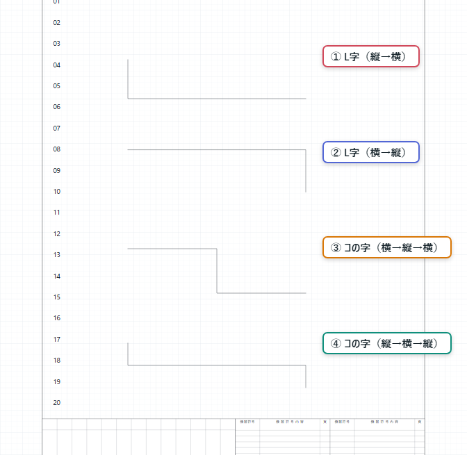{: .shot-panel}

> 💡 **ヒント:** 配線の端点は、近くの端子・接点・コイルなどの**接続点へ自動で吸着**します。
> 吸着した配線は、部品を動かすと端点が一緒についてきます。
> 部品を選択すると部品の近くに「配線／回転／複製／編集」が表示されます。ここで「配線」を押すと、その部品の接続点だけが緑の小円で表示されます。複数端子を持つ機器では、配線を伸ばしたい小円を選ぶまで配線は開始されません。左パレット、上部ツール、`W` キーから配線ツールを選んだ場合も、選択中の部品があれば同じ挙動です。
> 丸端子へ接続した配線は、接続判定上は端子中心につながりますが、表示線は円の外周で止まり、円内には描画されません。

水平に近い方向へ配線を伸ばすと終点Xだけがグリッドへ吸着し、Yは始点と完全に一致します。
垂直に近い方向では終点Yだけがグリッドへ吸着し、Xは始点と一致します。
始点が `Y=120.42` や `X=80.31` のような端数座標でも水平・垂直を保てます。
斜め方向へドラッグして折れ配線を作る場合は、終点のX/Yがグリッドへ吸着します。
直線も同様に、水平ではY、垂直ではXを始点に固定します。
信号矢印と連動破線も同じ軸別スナップです。水平に作図・伸縮するときはYを始点側に固定し、
垂直に作図・伸縮するときはXを始点側に固定するため、固定軸が端数座標でも斜めになりません。

L字配線の折れ順はドラッグ開始直後の方向に従います。最初に横へ動かした場合は「横→縦」、
最初に縦へ動かした場合は「縦→横」になります。配線を1本確定すると自動的に選択ツールへ戻るため、
続けてシンボルをクリックしても次の配線を誤って開始しません。続けて配線する場合は再度 `W` を押します。

配線同士を重ねたり選択しただけでは黒い接続点を自動生成しません。分岐を明示する場合は、
部品パレットの「接続点」または機能メニューの「接続点生成」を使用します。
> 「つないだつもり」のミスは、機能メニューの「監査」（§12.7）の未接続端点チェックで発見できます。

> 💡 **ヒント:** 描き直したいときは `Ctrl+Z`、配線だけ消したいときは選択して `Delete` です。

配線を選択すると、右パネルで始点、終点、中間点の座標を編集できます。
「線番調整Y」はほかの位置調整欄と同じく、プラスで上、マイナスで下へ移動します。

配線、直線、信号矢印を選択すると、図面上の各点に小さなハンドルが表示されます。端点や中間点のハンドルをドラッグすると、図面上で直接点位置を変更できます。

基本図形の直線を新規作成すると、ドラッグ方向は始点を基準に15度刻み（0、15、30、45、60、75、90度…）へ自動でそろいます。始点が120.32mmのような端数座標でも補正され、水平なら始点と終点のY、垂直ならXが正確に一致します。作成後は始点・終点のX/Y欄で任意の角度へ変更できます。選択中は始点を青い「始」、終点を橙色の「終」で区別します。直線・連動破線・配線の「端点表示」では、始点／終点の黒い接続点を個別にON/OFFできます。矢印は始端と終端それぞれについて「なし」「送り先」「受け取り側」から独立して選べます。送り先は信号矢印の開き矢印、受け取り側は信号矢印の「フォーク（母線端）」と同じ形状です。

直線・連動破線・配線は「線幅 mm」で太さを変更し、「スタイル・メモ」の線色から色を変更できます。指定した太さと色は通常表示と端点矢印へ同じように反映されます。

「中間点追加」を押すと、配線に折れ点を追加できます。2点のL字配線では、いま表示されている折れ角（折れ向き反転を含む）がそのまま実際の点になります。「中間点削除」を押すと最後の中間点を削除します。

「配線を分割」は、L字配線なら**折れ角の位置**で2本の直線に分かれます（まっすぐな配線は中央で分割）。

点編集で斜め区間ができた場合は、「直交整形」を押すと必要な折れ点を追加し、水平/垂直だけの配線に整えます。

図9-2のように配線を選択すると、端点と中間点に四角いハンドルが出て、右パネルには
「中間点追加」「直交整形」「折れ向き反転」「終点を延長/トリム」「配線を分割」が表示されます。
形を直すだけならハンドルをドラッグし、規則的に整えたいときは右パネルのボタンを使います。

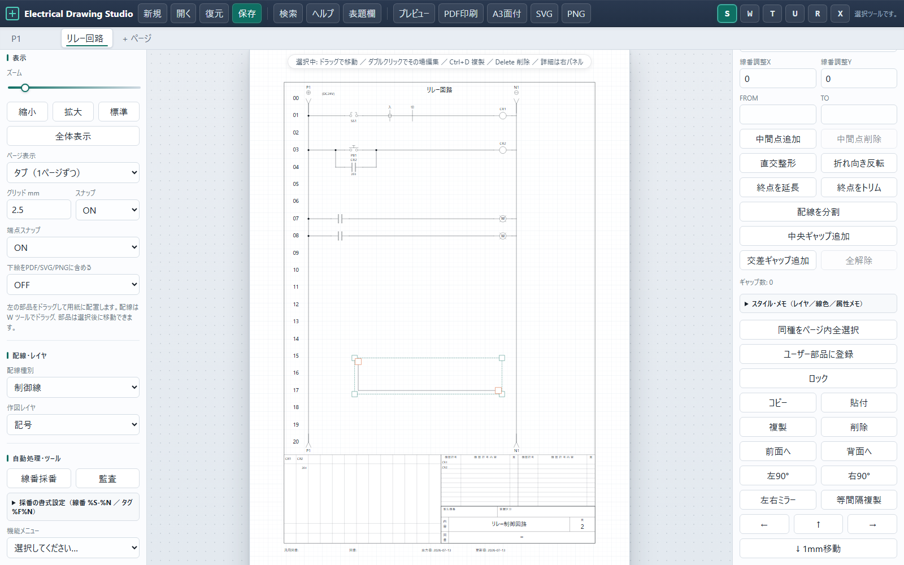{: .shot-full}

機能メニューの「縦配線列」で、複数の縦配線を一括生成できます。本数、開始X、上Y、下Y、ピッチ、線番接頭辞、線番開始番号を指定します。端子台へ伸びる縦配線を先に並べると、部品配置の基準にできます。

開始位置・ピッチ・本数から用紙内に収まる最大本数を自動判定します。作図範囲を越える指定では生成せず、ステータスバーへ理由を表示します。スナップON時は開始位置とピッチも現在のグリッドへ揃います。

機能メニューの「横配線行」で、複数の横配線を一括生成できます。本数、開始X、終了X、開始Y、ピッチ、線番接頭辞、線番開始番号を指定します。横方向の母線、盤間配線、上下に並ぶ信号線を先に引くと、後から端子や部品を合わせやすくなります。

横配線行も、用紙またはラダー図枠の作図範囲を越える指定では生成しません。

### 9.2 配線種別

左パネルで配線種別を選択できます。

- 制御線
- 動力線
- 安全線
- 盤外/参考線

盤外/参考線は自動線番の対象外です。

機能メニューの「配線種別管理」で、配線種別の名称、色、線幅、破線、自動線番対象外を編集できます。

「種別追加」で新しい配線種別を追加できます。

### 9.3 線番

配線を選択すると、右パネルで線番を入力できます。

もっと速いのは**その場編集**です。配線を**ダブルクリック**すると図面上に小さな入力欄が
開き、そのまま線番を打てます。

- `Enter` = 確定 ／ `Esc` = 取消
- `Tab` = 確定して**次の配線**の入力欄へ移動（`Shift+Tab` で前へ）

`Tab` を使うと、上から順に 11 → 12 → 13 … と線番を連続入力できます。
部品のダブルクリックはラベル、文字要素のダブルクリックは本文が同じ操作感で編集できます。

線番固定を ON にすると、自動線番を実行してもその配線の線番は上書きされません。

線番非表示を ON にすると、線番はデータとして保持したまま図面上の表示だけを隠せます。

左パネルの「線番採番」を押すと、自動線番を付与できます。

線番書式では以下を使えます。

- `%S`: シート番号
- `%P`: ページ名
- `%D`: 図番
- `%I`: ページの設備コード
- `%L`: ページの場所コード
- `%R`: **行番号**（設備標準図枠の行00〜20。2桁）
- `%N`: 連番

例: `%S-%N`、`%I-%L-%N`

> 💡 **行ベース採番:** 書式を `%S%R` にすると「1頁の05行 → 105」のような
> **頁+行アドレス式の線番**になります（設備標準様式の線番規則）。
> 同じ行に複数のネットがある場合は番号が重なるため、必要なら `%S%R-%N` のように連番を足してください。

### 9.4 配線ギャップ

配線を選択し、右パネルの「中央ギャップ追加」を押すと、配線中央に白抜きの隙間を作れます。

交差しているが接続しない線、参照線、一部図面表現に使用します。

選択した配線が他の配線と交差している場合は、「交差ギャップ追加」を押すと接続点のない交差位置へギャップをまとめて追加できます。接続点が置かれている交点は接続とみなし、ギャップ追加の対象外になります。

「中央ギャップ解除」または「全解除」を押すと通常の配線表示に戻ります。

帳票 CSV と帳票表の詳細には、ギャップ付き配線が `gap=true` と `gapCount=数` として出力されます。

### 9.5 配線順序

配線を選択すると、右パネルで FROM と TO を入力できます。

FROM と TO を空欄にすると、帳票では配線端点の近くにある端子、部品、接続点などから自動推定します。

機能メニューの「配線順序(FROM/TO)」で、現在ページの配線を一覧で確認できます。

一覧では、自動推定された FROM/TO を見ながら、手動の FROM/TO を入力できます。

「配線順序を更新」を押すと、入力した FROM/TO が配線へ保存されます。

「From-To一覧CSV（全ページ）」を押すと、全ページの配線について
ページ/線番/FROM/TO/配線種別を1行ずつ並べた `wire-from-to.csv` を書き出せます
（手動FROM/TOがあればそれを、なければ自動推定を出力します）。

帳票 CSV と帳票表の詳細には、手動指定した配線が `sequence=manual` として出力されます。

### 9.6 接続点生成

「接続点生成」を押すと、配線端点が重なる場所や配線が直交交差する場所に接続点を自動配置します。

### 9.7 信号矢印

信号矢印は別ページや別位置への接続参照に使用します。

矢印のラベルに同じ信号名を入力すると、クロス参照で関連を確認できます。

右パネルで信号矢印種別を選択できます。

- 参照
- 発信元
- 受信先

### 9.8 端点スナップ

端点スナップを ON にすると、配線作図時に既存配線端点、端子、端子台ノード、接点端、コイル端、ランプ端、ブザー端、機器端子、接続点などへ吸着します。

配線端点がシンボルの接続点に重なっている場合、そのシンボルをドラッグ移動すると接続済み配線の端点も追従します。これにより、あとから部品位置を調整しても配線が端子から離れにくくなります。

既存配線の上に接点、コイル、ヒューズ、遮断器、ランプ、ブザーなどを配置すると、部品の左右端子位置で配線が自動的に分割されます。部品の中を配線が突き抜けた表示になりにくく、インライン記号としてきれいに配置できます。

## 10. 端子と端子台

### 10.1 端子

端子部品はラベルに端子番号を入力できます。

### 10.2 端子台

端子台は以下を編集できます。

- 名称
- 端子数
- 開始番号
- 方向
- 端子形状
- 接頭辞
- ジャンパ（渡り線。例: `1-2;3-5`）
- 端子名（1行1点。空行は自動番号のまま）
- 端子台形状（ユニット列/ピル形）
- 段数（ユニット列のみ。2段にすると左右2列の端子円になり、右列は「2段目開始/接頭辞」で採番。
  配線は左右どちらの端子円にも接続できます）

方向は「横」と「縦」を選べます。入出力端子列や縦方向のコネクタを作る場合は「縦」を選びます。

端子形状は「丸」と「角」を選べます。丸端子のコネクタ列や、角端子の端子台表現を図面に合わせて切り替えます。

### 10.3 端子番号

機能メニューの「端子番号の振り直し」で、選択中の端子または現在ページの端子/端子台へ番号を振り直します。

### 10.4 端子台エディタ

機能メニューの「端子台エディタ」で、全ページの端子台とコネクタを一覧表示します。

一覧上で名称、端子数、開始番号、方向、端子形状、接頭辞を編集できます。

{: .shot-wide}

### 10.5 端子CSV取込

機能メニューの「端子CSV取込」で、CSV または TSV ファイルから端子接続図ページを作成できます。

対応する列名は、端子台、端子、線番、信号、接続先、備考です。

列名がない場合は、1列目から順に端子、線番、信号、接続先、備考として読み込みます。

生成されるページは設備標準様式です（レール+横配線+端子小円+ユニット列端子台）。
端子円の中にはCSVの端子名が表示され、線番は終点寄せ、信号と接続先は右側に表示されます。

図10-2では、左からレール、線番付き横配線、端子小円、端子台、信号説明の順に並びます。
CSV取込後は、まず端子名と線番が意図どおり対応しているかを上から1行ずつ確認してください。

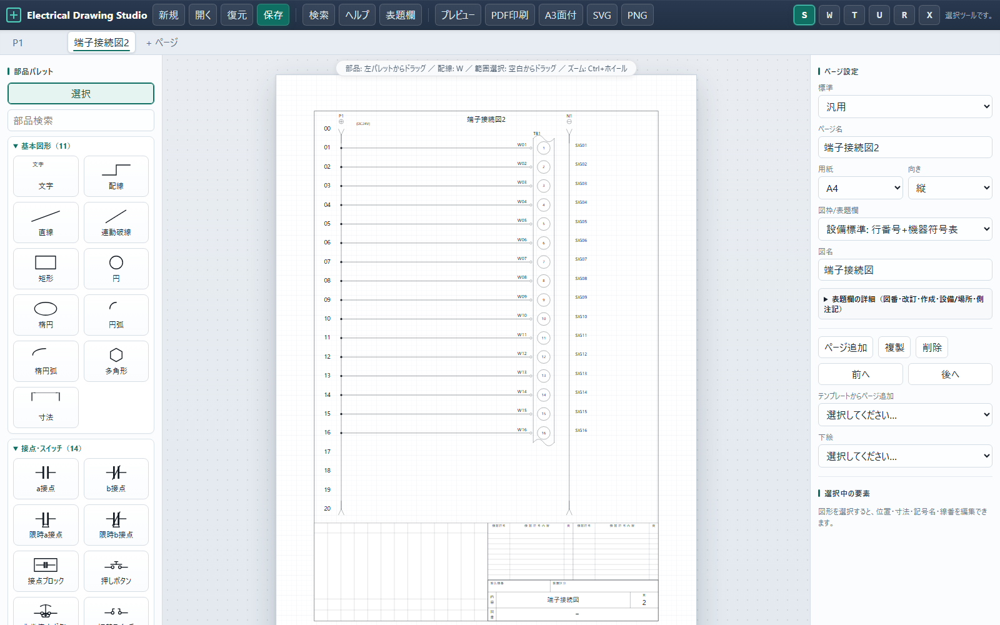{: .shot-full}

17点を超える場合は、自動的に複数ページへ分割されます。

### 10.6 端子台プラン表

機能メニューの「端子台プラン表」で、全ページの端子台/コネクタについて
「端子ごとの線番・接続先・ジャンパ」を一覧できます。CSV出力と表としての挿入に対応します。
接続先は端子に接続された配線の反対側にある部品から自動推定します。

## 11. PLC/I-O と機器箱

### 11.1 部品編集

PLC/I-O 部品は I/O 行数と I/O 名を編集できます。

機器箱は左右ピン数とピン名を編集できます。ラベルを空欄にすると中央文字も表示されません。

I/O 名やピン名は 1 行 1 点で入力します。

### 11.2 PLC CSV取込

機能メニューの「PLC CSV取込」で、CSV または TSV ファイルから PLC I/O 接続図ページを作成できます。

対応する列名は、アドレス、入出力、信号、線番、接続先、備考です。

列名がない場合は、1列目から順にアドレス、信号、線番、接続先、備考として読み込みます。

生成されるページは設備標準様式です: 設備標準図枠+P1/N1レール+横配線（線番は終点寄せ）+
端子小円+右側のユニット列（端子円にアドレス表示）。配線端点はユニットの端子位置に正確に一致します。
CSVに線番がある行だけ、その線番を配線上へ表示します。アドレスを線番の代わりに重ねて表示しないため、
端子円内のアドレスと配線文字が二重になることはありません。

入出力の区別は右側の説明文（入力/出力+信号名+接続先）に表示され、
配線の FROM/TO にも自動設定されます。

17点を超える場合は、自動的に複数ページへ分割されます。

### 11.3 PLC入出力回路テンプレート

CSVを用意せず画面上で一括生成する場合は、右パネルの「テンプレートからページ追加」で
「PLC入出力回路」を選びます。

1. 「モジュールプリセット」で入力/出力と点数に近いものを選びます。
2. 種別、ユニット名、開始アドレス、点数を確認します。
3. 入力回路では「各行に接点を配置」を選び、「ページ追加」を押します。

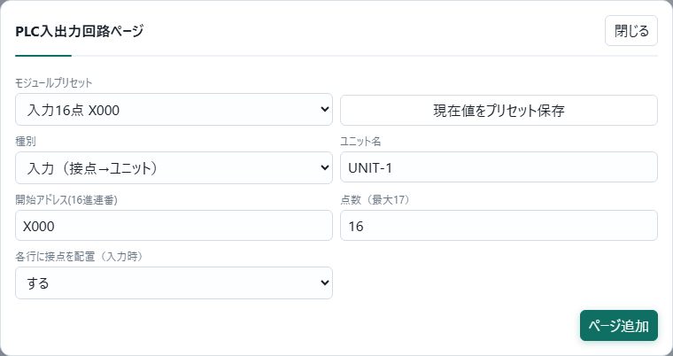{: .shot-wide}

入力回路は接点から右側ユニットへ、出力回路は左側ユニットからコイルへ向かう構成になります。
図11-2のように16進アドレスが端子円内で連番になっていることと、ページ名・図名・図番を確認して仕上げます。
画面から生成する入力/出力回路では、アドレスを配線の線番として重複表示しません。

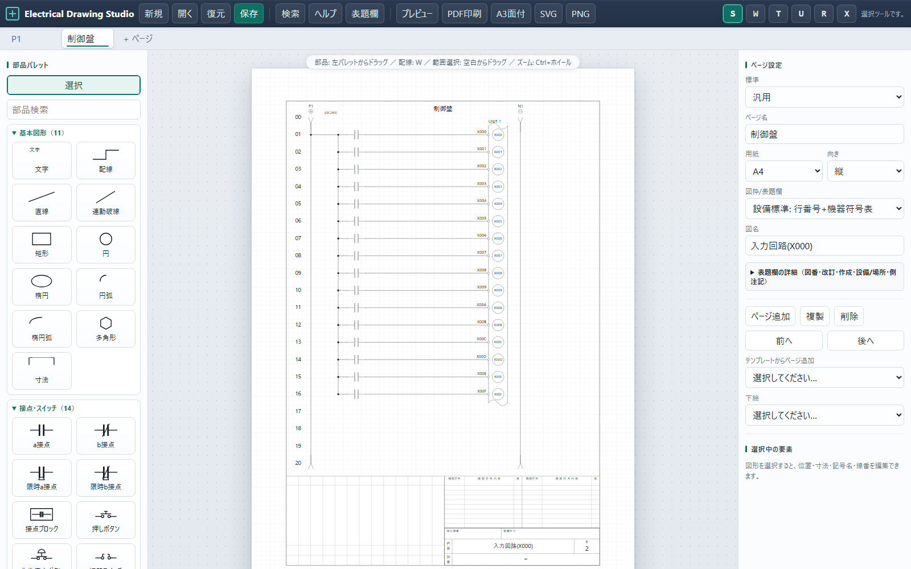{: .shot-full}

## 12. 自動処理

この章の機能は「手作業だと間違えやすい番号付けや確認」をツールに任せるためのものです。
本章の各機能は、左パネルの「線番採番」「監査」ボタン、または機能メニュー（§3.3）から実行します。

作図が一段落したら、次の順で流すのがおすすめです。

1. 「部品タグ採番」……部品に CR1, PL1 などのタグを自動付与（§12.5）
2. 「線番採番」……配線に線番を自動付与（§12.1）
3. 「監査」……未接続・未採番・重複などの問題を一覧チェック（§12.7）

> 💡 **ヒント:** 自動処理はいつでも何度でも実行できます。手で入力したタグを
> 固定したい場合は「タグ固定」（§12.5）を使うと、再採番でも変わりません。

### 12.1 線番

配線へ自動的に線番を付与します。

自動線番は**ネット単位**です。端点の一致、T分岐（端点が他の配線の線上にある）、
接続点でつながった配線は同じ電位（ネット）とみなし、1ネットに1つの線番を割り当てて
ネット内の全配線へ共有します。表示はネット内の最長配線1本にまとめ、他の配線は
自動的に線番非表示になります（線番固定の配線は変更されません）。

発信元/受信先の信号矢印（同じラベル）がネットに接している場合は、
ページをまたいで同じ線番を共有します。

全ページ対象か現在ページのみかを選択できます。

既存線番を上書きするか、未採番のみ対象にするかも選択できます。

### 12.2 接続点生成

配線の端点共有や直交交差から接続点を生成します。

### 12.3 ラング追加

「ラング追加」を押すと、現在ページへラダー回路の横方向ラングを1本追加します。

ラダーページで使用すると、既存ラングの下に次の番号のラングが追加されます。

### 12.3b 行挿入/行削除（行シフト）

回路の途中に行を増やしたい・詰めたいときに使います。機能メニューの
「**行挿入/行削除（行シフト）**」で、設備標準図枠の行番号（00〜20）を基準に、

- **行を挿入**: 指定行の位置に空行を作ります（指定行から下の要素が行数ぶん下がります）。
- **行を削除**: 指定行を詰めます（下の要素が上がります）。

縦の配線は境界をまたぐ部分だけが動くため、**縦レールは自動で伸び縮み**します。
削除する行の上に部品が載っている場合は、安全のため中止してメッセージを表示します
（先に部品を移動または削除してください）。ロック中の要素は動きません。

### 12.4 端子番号

端子や端子台の番号をまとめて振り直します。

### 12.5 部品タグ

部品タグを自動採番します。

左パネルの「部品タグ書式」で、部品タグの作成ルールを指定できます。既定値は `%F%N` です。

使用できる置換:

- `%F`: 部品種別ごとのファミリ接頭辞
- `%N`: 連番
- `%S`: シート番号
- `%P`: ページ名
- `%D`: 図番
- `%I`: 設備コード
- `%L`: 場所コード

例: `%F-%I-%L-%N` を指定すると、押しボタンは `PB-PNL-FLD-01` のように採番されます。

`%N` を含まない書式を入力した場合は、連番が失われないよう末尾に `%N` が補完されます。

「部品タグ規則」を押すと、`%F` に入る部品種別ごとの接頭辞を編集できます。

- 押しボタン: `PB`
- コイル/接点: `CR`
- ランプ: `PL`
- トランス: `T`
- ファン: `FAN`
- PLC/I-O: `PLC`

接頭辞を空欄にした部品種別は、自動タグ採番の対象外になります。「既定に戻す」で標準の接頭辞へ戻せます。

> 💡 **クロスリファレンスジャンプ:** 同じタグのコイルと接点は、右パネルから相互に移動できます。
> - **接点を選択** → 「親コイルへ移動（頁+行）」ボタン
> - **コイルを選択** → 「接点へ移動」に全接点のアドレス一覧（b接点は末尾に b）
>
> クリックするとページが切り替わり、対象が選択され、画面が要素の位置まで自動スクロールします。
> 監査・検索・各種一覧の「選択」ボタンも同じように自動スクロールします。

自動採番を実行すると、開始番号を入力できます。`10` を指定すると、`PB10`、`PB11` のように採番されます。

部品の右パネルで「部品タグ固定」を ON にした部品は、自動採番の対象から除外されます。

例:

- 押しボタン: PB01
- コイル/接点: CR01
- ランプ: PL01
- ブザー: BZ01
- PLC: PLC01

### 12.6 クロス参照

線番、信号矢印、部品タグをページ横断で一覧表示します。

信号矢印は、発信元、受信先、参照の種別付きで表示されます。

一覧のボタンを押すと、該当ページへ移動し、その要素を選択します。

### 12.7 監査

図面の問題を検出します。

検出対象:

- 未採番配線
- 同一ネット内の線番混在／接続されていない別ネットへの同一線番
- 未採番部品タグ
- 部品タグ固定なのにタグが空の部品
- 同一部品種別の部品タグ重複
- 空ラベル
- 用紙外にはみ出した要素
- 未接続の可能性がある配線端点
- 片側だけの信号矢印
- 発信元または受信先が不足している信号矢印
- 同一ページ内の端子台名称重複
- 不正な端子数

監査結果に「選択」ボタンがある場合は、その問題の対象要素へページを切り替えて選択できます。

監査ダイアログ上部の**検査ルール**チェックで、検出項目を個別にON/OFFできます
（未採番配線／ネット整合／空ラベル／用紙外／未接続端点／コイル・接点／**信号矢印の相手**／盤配置）。
この設定は標準パックの出力・取込にも含まれます。

監査結果は、種類を確認してから各行の「選択」で該当箇所へ移動し、修正後にもう一度監査します。
件数を減らすことより、意図した未接続や例外まで機械的に直さないことが重要です。

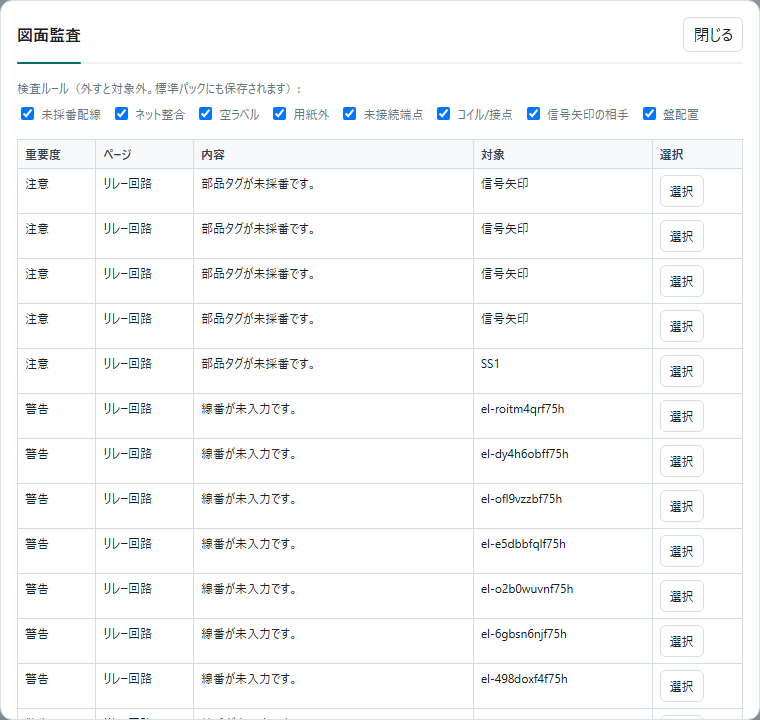{: .shot-wide}

## 13. 検索

上部の「検索」を押すと、図面内を検索できます。

検索対象:

- 線番
- 部品タグ
- 説明、設備、場所、品番などの電気属性
- 文字
- 端子名
- 表のセル文字
- ピン名
- 属性メモ

検索結果の「選択」を押すと、該当ページへ移動し、その要素を選択します。

「置換後の文字列」を入力して「一括置換」を押すと、**置換プレビュー**が開きます。

- 「ページ／種別／項目／変更前／変更後」の一覧で、置換内容を適用前に確認できます。
- **行ごとのチェック**で適用対象を選べます（全選択／全解除ボタンあり）。
- 「選択した置換を実行」で確定します。適用は**1回のUndo（Ctrl+Z）でまとめて戻せます**。
- そのままダイアログを閉じれば図面は一切変わりません（取消）。

対象は線番・ラベル・文字・タグ・メモ・表セル・ピン名・端子名・説明・FROM/TOの各文字列です。

図13-1はタグ `CR2` の検索例です。結果にはページ名と要素種別が表示されるため、
同じ文字がコイルと接点のどちらに使われているかを確認してから「選択」を押せます。

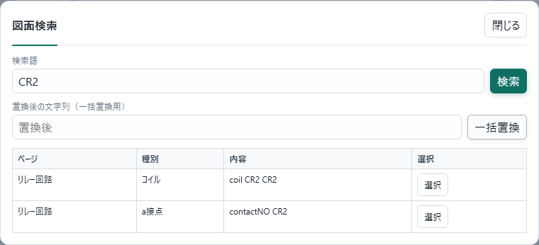{: .shot-wide}

## 14. 表題欄一括更新

上部の「表題欄」を押すと、全ページの表題欄をまとめて更新できます。

上側の入力欄には、プロジェクト全体で共通して使う値を入力します。

入力対象:

- 図名
- 設備
- 図番
- 改訂
- 作成
- 日付

「表題欄マッピング」では、表題欄の各項目に流し込む値を選びます。

選択できる参照元:

- プロジェクトの図名、設備、図番、改訂、作成、日付
- ページ名
- シート番号
- シート番号/総ページ数
- 空欄
- 既存値を保持

「現在ページへ適用」を押すと、開いているページだけを更新します。

「全ページへ適用」を押すと、すべてのページを更新します。

「空欄の項目だけ更新」を選ぶと、既に入力済みの項目は維持します。

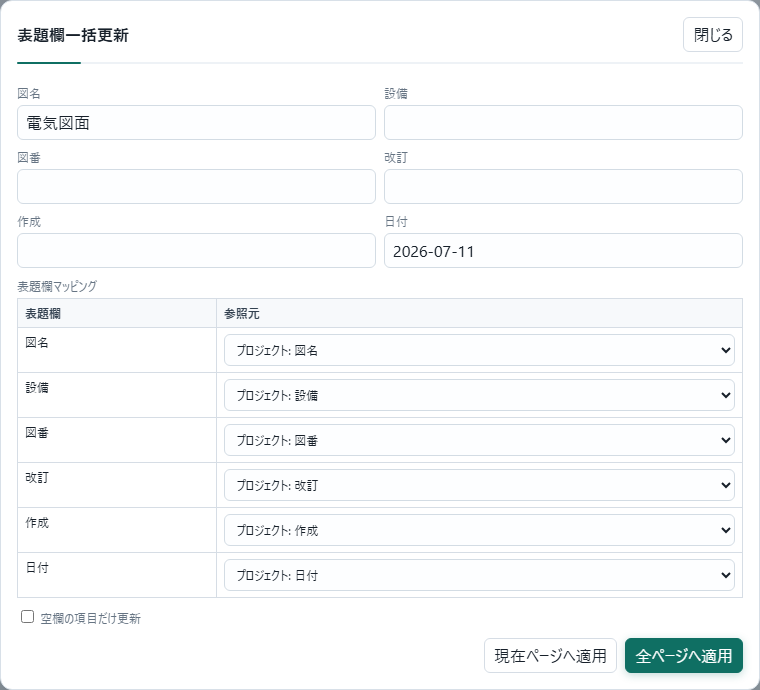{: .shot-wide}

## 15. ユーザー部品

### 15.1 登録

図形や記号を選択し、「ユーザー部品に登録」を押します。

Shift クリックで複数の要素を選択している場合は、「回路として登録」を押すと、選択中の配線、接点、コイル、文字などをまとめて登録できます。

名前を入力すると、左パネルの部品パレットに追加されます。

登録した部品や回路は、通常の部品と同じようにパレットから配置できます。

### 15.2 管理

機能メニューの「ユーザー部品管理」で、登録済みユーザー部品を一覧表示できます。

不要なユーザー部品は削除できます。

## 16. 保存と読込

保存方法は目的によって使い分けます。まずこの表で全体像をつかんでください。

| 方法 | 操作 | 用途 | 消えるリスク |
|---|---|---|---|
| JSON保存 | 上部「保存」 | **正式な保存**。再編集・受け渡し用 | ファイルを消さない限り残る |
| 自動バックアップ | （自動） | 保存し忘れ・誤操作からの復帰 | ブラウザのデータ消去で消える |
| プロジェクト管理 | 機能メニュー | 複数図面の切替・下書きの保管 | ブラウザのデータ消去で消える |
| PDF/SVG/PNG/DXF | 上部・機能メニュー | 提出・印刷・他CADへの受け渡し | 再編集には使えない(※DXFは取込可) |

> ⚠️ **注意:** 再編集したい図面は必ず **JSON形式** で保存してください。
> PDFやPNGからは図面を復元できません。

### 16.1 JSON保存

上部の「保存」を押すと、図面全体を JSON ファイルとして保存します。

JSON にはページ、図形、属性、ユーザー部品、標準設定が含まれます。

### 16.2 JSON読込

上部の「開く」を押し、保存済み JSON ファイルを選択します。

読み込んだ図面は再編集できます。

保存データには**形式の版数**（`schemaVersion`）が記録されます。
将来アプリの保存形式が変わっても、**古いJSONは読み込み時に自動で現行形式へ変換**されるため、
昔保存したファイルもそのまま開けます。逆に、**より新しい版のアプリで保存されたファイルは
内容を失ったまま上書きしないよう読込を中止**し、新しい版のアプリで開くよう案内します。

JSONのページ・要素・設定・表題欄レイアウトなどは、画面へ反映する前にまとめて検査されます。
破損ファイルや形式不正が見つかった場合は現在の図面とUndo履歴を変更せず、ステータスバーへ
理由を表示します。読込後の描画に失敗した場合も、読込前の状態へ戻ります。

現在の形式は **schemaVersion 4** です。schemaVersion 2以前の図面を開くと、2.5mmグリッドへ正規化された
対象の固定形状シンボルを新しい寸法へ移行し、その旧接続ピンで終端していた配線と接続点も
新しいピン位置へ自動追従します。移行対象の既存図面は配線接続を保ったまま編集できます。
回転済みの旧要素も回転角を保ったまま移行されます。機器箱（28×16→30×25）と端子箱
（22×18→22.5×15）も対象で、各端子へ接続していた配線・接続点が新しい端子位置へ追従します。

schemaVersion 3から4への移行では、アーチ形CPを左右12.5mmの現行寸法へ直し、右側（縦向きでは下側）
の配線端、接続点、機械連動線を新しい接続ピン・アーチ頂点へ追従させます。旧端子台/PLCユニット列は、
周囲の配線端と旧端子円から意図された端子中心を判定し、幅10mm・中央接続の現行形へ変換します。
旧2段端子台は従来の接続位置を保持します。旧生成器が重ねていた小端子は、全端子が既定形・既定位置で
揃う場合だけ取り除き、手作業の端子や不完全な組合せは残します。

また、旧位置にある変圧器の上タップと配線・接続点も、主ピンの1行（9.5mm）上にある現行タップへ
追従します。これらの互換補修は同じJSONへ繰り返し適用しても座標が重ねて移動しません。

### 16.3 自動バックアップ復元

変更操作のたびにブラウザ内へ自動保存します。さらに**約5分おきに「世代」として
少し前の状態を最大3つ**残しています。

上部の「復元」を押すと一覧ダイアログが開き、次から選んで戻せます。

- **最新**: 直前の操作までの状態
- **世代1〜3**: 約5分おきに残した少し前の状態（保存日時つき）

「誤操作に気づかないまま何度も上書きしてしまった」場合でも、世代から数分前へ戻れます。
復元すると現在の画面内容は置き換わるため、必要なら先にJSON保存してください。

> ⚠️ **注意:** 下絵画像を多用するなどで図面が大きくなり、ブラウザ内へ保存しきれなくなると、
> ステータスバーに「自動バックアップを保存できません」と一度だけ警告が出ます。
> この状態では自動バックアップに頼れないため、上部「保存」からJSONファイルとして保存してください。

### 16.4 プロジェクト管理（ブラウザ内保存）

機能メニューの「プロジェクト管理（ブラウザ内保存）」で、複数の図面をこのブラウザへ
名前付きで保存し、切り替えできます。

- 現在の図面を新規保存: 保存名を付けてブラウザ内へ保存します。
- 読込: 保存済みプロジェクトを開きます（現在の内容は置き換わるため、必要ならJSON保存してから）。
- 上書き / 改名 / 削除: 保存済みプロジェクトを更新・整理します。

ブラウザのデータ消去で失われるため、恒久保存には JSON 保存を併用してください。

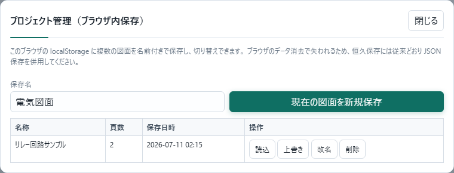{: .shot-wide}

### 16.5 図面差分（版比較）

機能メニューの「**図面差分（旧版JSONと比較）**」で、以前保存したJSONと現在の図面を比較できます。

1. 比較したい**旧版のJSONファイル**を選びます。
2. ページごとの**追加／変更／削除**の件数一覧が表示されます。
3. 「表示」を押すと、そのページの上に差分が重ね描画されます:
   - **緑の枠** = 追加された要素
   - **橙の枠** = 変更された要素（位置・寸法・ラベルなど）
   - **赤の枠+うすい赤の図形** = 削除された要素（旧版の姿をゴースト表示）

改訂前後の検図、「どこを直したか」の確認、他の人が編集した図面の変更点チェックに使えます。
判定は要素ごとのID基準なので、単に移動しただけの要素は「変更」として正しく検出されます。

### 16.6 履歴タイムライン

機能メニューの「履歴タイムライン」では、操作名と時刻が付いた履歴を最大60件確認できます。
戻したい行の「この時点へ」を押すと、その操作直後の状態までまとめて戻ります。
戻った直後であれば、`Ctrl+Y` または新しい側の履歴へ移動してやり直せます。

下絵画像を含む図面では、Undo履歴内の画像本体を操作回数分複製せず共有して保持します。
そのため、下絵の位置・透明度などを繰り返し調整しても履歴メモリが画像容量×操作回数に
膨らみません。JSON保存と自動バックアップには画像本体が含まれるため、再読込後も復元できます。

> ⚠️ **注意:** 過去へ戻った後に新しい編集を始めると、それより新しい履歴は破棄されます。
> 不安な場合は先にJSON保存してください。

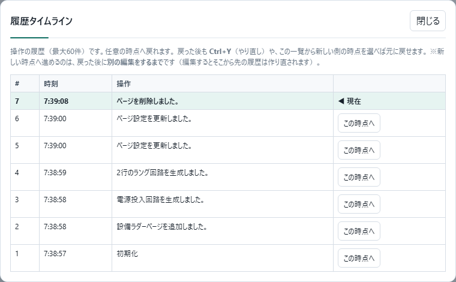{: .shot-wide}

## 17. 出力

### 17.0 印刷プレビュー

上部の「**プレビュー**」を押すと、印刷やPDF出力と**同じ内容**（グリッド・選択枠なし）を
画面内で確認できます。

- 全ページが縦に並びます。倍率は「幅に合わせる」「75%〜200%」から選べます。
- 「**このまま印刷**」を押すと、そのままブラウザの印刷ダイアログへ進みます。
- 印刷前に「線番の付け忘れ」「図枠からのはみ出し」「ページ順」を確認する習慣をつけると
  印刷のやり直しが減ります。

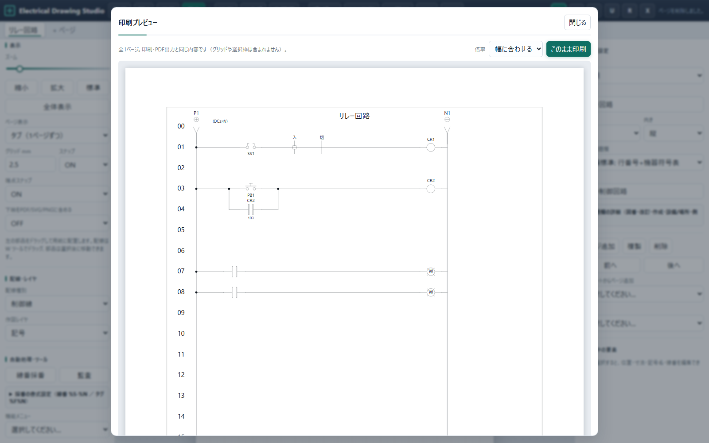{: .shot-full}

### 17.1 PDF印刷

図面をPDFファイルにする手順です。

1. 上部の「PDF印刷」を押します。ブラウザの印刷ダイアログが開きます。
2. 「送信先（プリンター）」で **「PDFに保存」** を選びます。
3. 用紙サイズが図面と同じ（通常はA4）になっていることを確認します。
4. 「保存」を押し、保存先を選びます。

全ページが1つのPDFになります。作図補助グリッドや下絵（設定OFF時）は印刷されません。

> 💡 **ヒント:** 実際のプリンターを選べばそのまま紙に印刷できます。
> 「背景のグラフィック」設定は不要です（図枠・記号はすべて印刷対象として出力されます）。

### 17.2 A3面付

「A3面付」を押すと、A3 縦に 2 ページずつ面付けして印刷します。

1 枚の A3 に 2 枚の A4 図面を並べたい場合に使います。

### 17.3 SVG

「SVG」を押すと、現在ページを SVG ファイルとして出力します。

### 17.4 PNG

「PNG」を押すと、現在ページを PNG 画像として出力します。

### 17.5 DXF

機能メニューの「DXF出力（現在ページ）」で、現在ページを DXF ファイルとして出力します。
「DXF出力（全ページ）」は、全ページを `連番_ページ名.dxf` として順に書き出します
（ブラウザが複数ファイルのダウンロード許可を求めた場合は許可してください）。

配線ギャップはDXF上では線分を分割して表現します。下絵画像はDXFには含めません。
雲マークと円弧はARCエンティティとして出力されます（楕円・楕円弧は折れ線近似）。

破線・一点鎖線・二点鎖線・細点線は、DXFでは線種（DASHED/CENTER/PHANTOM/DOTTED）として
出力されます（LTYPEテーブル同梱）。

### 17.6 帳票CSV

機能メニューの「帳票CSV出力」で、図面内の部品、配線、端子情報を CSV として出力します。

配線には FROM/TO 推定情報、手動 FROM/TO、線番固定、線番非表示、配線ギャップの情報が含まれます。

部品のタグ、説明、設備、場所、メーカー、品番、定格、項目は独立した列として出力されます。

### 17.7 帳票表挿入

機能メニューの「帳票表挿入」で、帳票を現在ページへ表部品として挿入できます。

帳票種別は、全要素、部品、配線、端子から選択できます。

設備フィルタまたは場所フィルタを入力すると、その属性に一致する行だけを表に挿入できます。

「列構成」のチェックで挿入する列を選べます（例: 部品帳票に メーカー・定格・設備・場所 を追加）。
選んだ列構成はプロジェクトへ保存され、次回以降と標準パックにも引き継がれます。

{: .shot-wide}

挿入した表は通常の表部品として移動、編集、印刷、保存できます。

## 18. 標準設定

右パネルの「標準」で標準パックを選択できます。

現在は以下を用意しています。

- 汎用
- トヨタ標準（仮）

トヨタ標準の具体仕様が確定したら、図枠、線番ルール、帳票、監査ルールを追加します。

### 18.1 レイヤ管理

機能メニューの「レイヤ管理」では、レイヤごとに表示、ロック、色を切り替えます。
完成済みの図枠や補助線を誤って動かしたくない場合は、対象レイヤをロックします。
一時的に画面から隠したい要素は、その要素が所属するレイヤの「表示」をOFFにします。

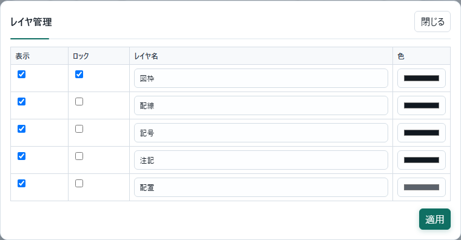{: .shot-wide}

### 18.2 配線種別管理

機能メニューの「配線種別管理」では、制御線・動力線・安全線などの名称、色、線幅、破線、
自動線番の対象外設定を編集できます。社内ルールを作る場合は種別を追加し、標準パックで共有します。

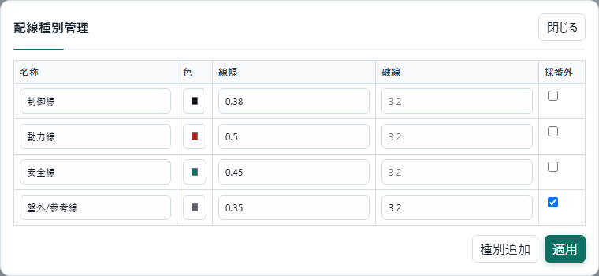{: .shot-wide}

## 19. よくある操作

### 19.1 端子接続図を作る

1. 右パネルのテンプレートから「端子接続図」を選びます。
2. レール+横配線+端子+ユニット列端子台が入ったページが追加されます。
3. 端子台を選択して端子数や開始番号を調整します。
4. 配線を選択して線番や属性メモを入力します。
5. 必要に応じて接続点生成、線番、端子番号を実行します。

CSV から作る場合は、機能メニューの「端子CSV取込」でファイルを選択します。

次のような CSV を読み込めます。

```csv
端子,線番,信号,接続先,備考
1,W101,START PB,PLC I00,
2,W102,STOP PB,PLC I01,
3,W103,MOTOR RUN,KM1 A1,
```

### 19.2 PLC I/O 図を作る

1. 右パネルのテンプレートから「PLC入力回路」を選びます。
2. ユニット名・開始アドレス・点数を入力すると、レール+接点+配線+ユニット列が一括生成されます。
3. 接点のタグや配線の線番、右側の説明を編集します。

CSV から作る場合は、機能メニューの「PLC CSV取込」でファイルを選択します。

次のような CSV を読み込めます。

```csv
アドレス,入出力,信号,線番,接続先,備考
I00,入力,起動PB,W100,PB1,
O00,出力,運転ランプ,W200,PL1,
```

### 19.3 ラダー回路図を作る

1. 右パネルのテンプレートから「設備ラダー」または「ラダー（汎用）」を選びます。
2. レール（母線）が入ったページが追加されます。
3. 左パネルから接点、コイル、ランプなどをラング上へ配置します（行位置へ自動スナップ）。
4. 機能メニューの「ラング追加」で、下段に次のラングを追加できます。
5. 必要に応じて線番、部品タグ、電気属性を編集します。

### 19.4 表紙や目次を作る

1. 右パネルのテンプレートから「目次」を選びます。
   基本図枠に見出し「図面目次」と編集可能な目次表（要素）が配置されます。
2. 目次表を選択します。
3. セル文字に図番、図名、備考を入力します。

## 20. トラブル対応

### 20.1 保存した図面を再編集したい

JSON ファイルを保存しておき、次回「開く」で読み込んでください。

PDF、PNG、SVG、DXF は出力用です。再編集用には JSON を使います。

### 20.2 図形が動かない

要素がロックされている可能性があります。

右パネルで「ロック解除」を押してください。

### 20.3 印刷にグリッドが出ない

正常です。グリッドは作図補助用で、PDF/SVG/PNG 出力には含めません。

### 20.4 PDFに保存したい

「PDF印刷」を押し、ブラウザの印刷画面で「PDFに保存」を選びます。

### 20.5 PDFスキャンを読み込んで自動変換できるか

現在の目的は、人がツール上で同じ図面を作図できることです。

スキャンPDFからの自動変換は現時点の対象外です。

## 21. 設備標準様式

工場設備で広く使われる電気図面様式（行番号付きラダー・機器符号表・頁+行参照）で
作図するためのモードです。

### 21.1 図枠「設備標準」

図枠/表題欄で「設備標準: 行番号+機器符号表」を選ぶと、次の図枠になります。

- 左端に行番号 00〜20（9.5mm ピッチ）。作図・移動時は行位置へ磁気スナップします。
- 左下: クロスリファレンス表（13列）。ページ上のコイルごとに、接点の使用位置が自動記入されます。
- 右下: 機器符号表（機器タグ・内容・頁が自動記入）と表題欄（客先機番・装置区分・内容・頁・図番）。
- ページ設定の「側注記」に入力すると、左余白へ縦書きで表示されます。
- 表題欄右下の組織名はプロジェクトの「作成」欄の値を表示します。

### 21.2 追加テンプレート

右パネルの「テンプレートからページ追加」から選びます（§4.5）。

- 設備ラダー: P1/N1 レール（複数レール可）、⊕⊖極性マーク、フォーク矢印つきのラダーページ。
- AC電源回路（受電・分岐）: AC200V三相/AC100V単相の受電、ELB、表示灯、CP分岐、
  送り回路、電線サイズ表とSCCR注記を配置します。
- AC電源回路（モータ）: サーボアンプ（1軸/2軸）またはインバータのモータ回路を配置します。
- DC電源回路: CP、スイッチング電源とN1/P0/P24/N24/Gの送り回路を配置します。
- PLC電源回路: PLCベース、スロット構成と入出力COM/制御電源/運転準備/動力供給を配置します。
- セーフティリレー回路: 2チャンネル非常停止入力、安全出力、モニタリレーと電源を配置します。
- PLC入出力回路: 開始アドレスから16進連番（例 X000→X00F / Y000→Y007）で一括生成。
  入力（接点→ユニット）と出力（ユニット→コイル）を種別で切り替えます。
- 端子接続図: レール+横配線+端子小円+ユニット列端子台の端子接続図（新様式）。

これらのページテンプレートでは、図枠の行番号（9.5mmピッチ）を参照表示として残しながら、
電気接続ピン、配線端・屈曲点、端子円中心、主要な箱の辺を**2.5mm方眼へ厳密に整列**します。
複数段を持つ変圧器、箱形コンセント、セーフティ回路の非常停止PBには、テンプレート専用の
10mmピッチ形状を使います。既存図面やパレットから手動配置した9.5mm形状は変更されません。

#### AC電源回路（受電・分岐）

設定ダイアログでは、電源電圧、接地/入力/送りレール名、漏電遮断器のタグと型式、
表示灯・盤内照明・ファン・REC送り・コンセント・GOT送りの有無、および変圧器容量を指定します。
電圧をAC100Vへ変えると、既定の `R,S,T` / `R01,S01,T01` は `R,N` / `R01,N01` に、
ELBは2極型式に切り替わり、変圧器は「なし」で無効になります。200Vへ戻すと既定値も戻ります。
既定値以外へ手入力したレール名や型式は、電圧を切り替えても上書きされません。

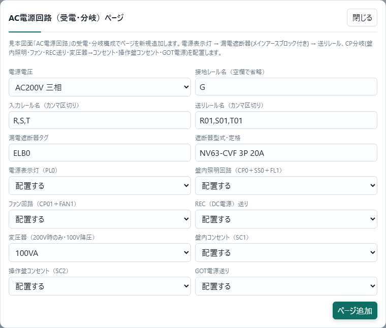{: .shot-wide}

AC200V三相の既定値では、`G+R/S/T` の入力、`PL0`、3極 `ELB0`、メインアースブロック、
`R01/S01/T01` の送りレールに続き、次の分岐を1ページへ配置します。

- `CP0 → SS0（切/入）→ FL1` の盤内照明、および `CP01 → FAN1`。
- `CP1` からDC電源用RECへの送り。
- `Tr1`（100VA/500VA/なし）で200Vから100Vへ降圧し、`CP3 → SC1` へ送る盤内コンセント。
- `CP4 → CP11 → SC2` の操作盤コンセント、および `CP12` からGOT電源への送り。
- 線番・サイズ・色の電線サイズ表とSCCR注記。

2線分岐の上下間隔は10mmです。既定配置のY座標は、表示灯37.5/47.5、盤内照明85/95、
ファン112.5/122.5、REC送り140/150、変圧器・SC1 170/180、SC2 187.5/197.5、
GOT送り207.5/217.5mmで、上下とも方眼線上にあります。

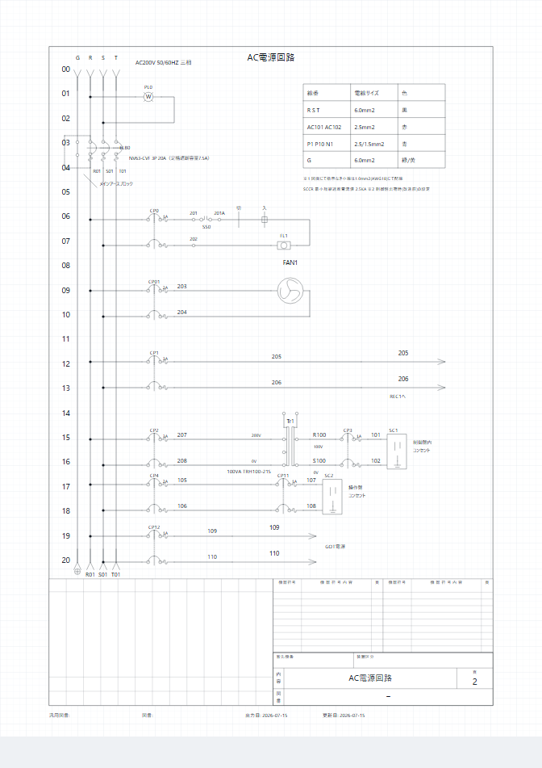{: .shot-full}

AC100V単相では `G+R/N` から `R01/N01` へ直接分岐し、降圧用変圧器を配置しません。
接地レール名を空欄にした場合は、Gレール、接地送り、および電線サイズ表のG行をまとめて省略します。

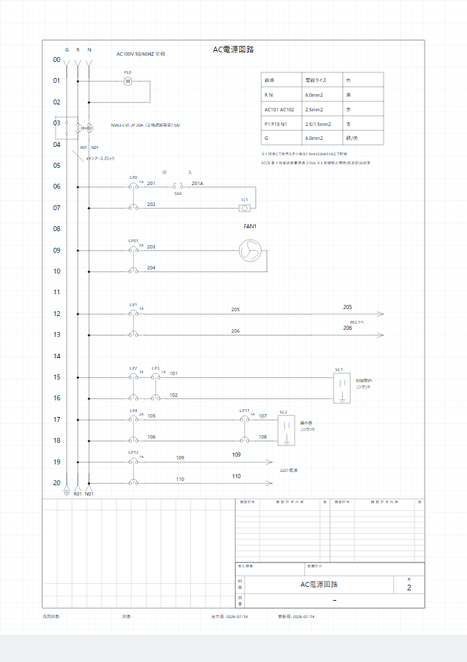{: .shot-full}

#### AC電源回路（モータ）

「駆動方式」でサーボアンプまたはインバータを選びます。方式を切り替えると、既定の相レール・
MC接点タグ・モータ先頭タグだけが、それぞれ `R1,S1,T1` / `MS1M` / `SM1` と
`R01,S01,T01` / `MC2M1` / `M1` の組に連動します。手入力した独自値は保持されます。

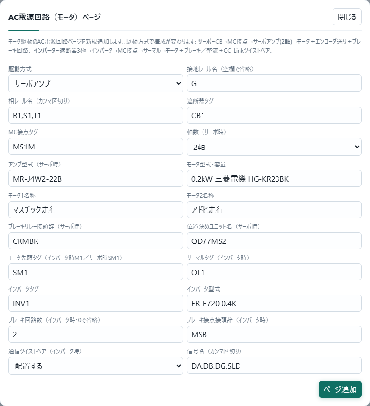{: .shot-panel}

サーボ方式では、3極CB、MC接点、サーボアンプ、U/V/W/PE端子とモータ、エンコーダ送り、
P24/N24ブレーキ回路、N1/P3M制御信号とブレーキリレーを生成します。モータ先頭タグの末尾が数字なら
軸ごとに連番（例: `AX9` → `AX9`,`AX10`）になり、数字がなければ1から付番します。

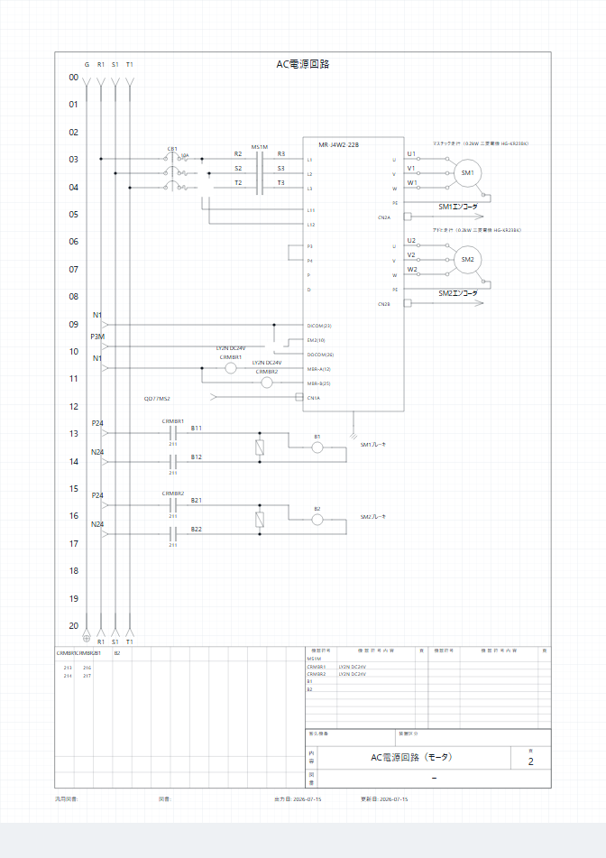{: .shot-full}

1軸を選ぶと2軸目のモータ、エンコーダ送り、ブレーキ回路、`MBR-B`端子と第2ブレーキリレーを省略します。

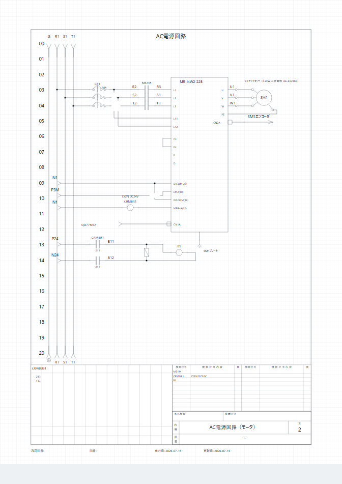{: .shot-full}

インバータ方式では、3極遮断器、インバータ、MC接点、2素子形サーマル、端子、接地付きモータ、
ブレーキ/整流回路（0〜4回路）、CC-Linkツイストペア（`DA/DB/DG/SLD`）を配置します。
入力したモータ型式・容量はモータの説明属性にも保存されます。

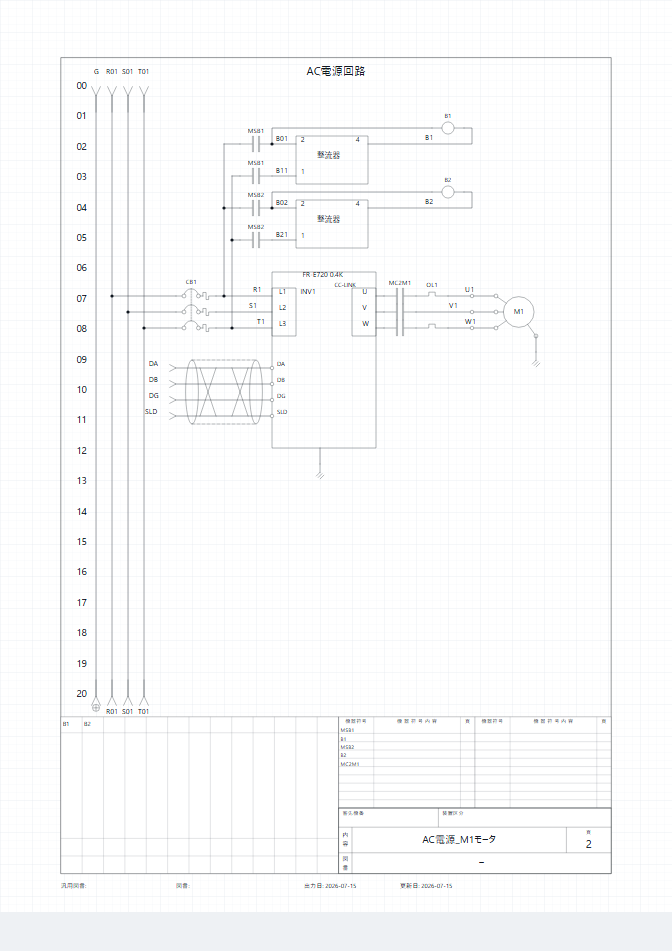{: .shot-full}

> 💡 見本図面の `OL1A/OL1B/OL2` のような熱動過負荷記号は、線上の `⊓` を
> **サーマル素子**、`○✕○` を **サーマルリレー**として作図します。インバータ方式では
> モータ分岐の相1・相3へサーマル素子を自動配置します。

#### DC電源回路

入力レール名、接地レール名、スイッチング電源のタグ/型式、ブレーキ電源分岐と接地送りの有無を
指定します。既定では2極 `CP1` から `REC1` のL/Nへ入力し、-VをN1、+VをP0へ送ります。
さらに `CP8` からP24/N24を分岐し、Gを接地記号付きで送ります。送り矢印の手前まで配線が連続するため、
別ページの同名信号とネットリスト上でも接続されます。
CP1とREC1の入力行は45/55mmです。

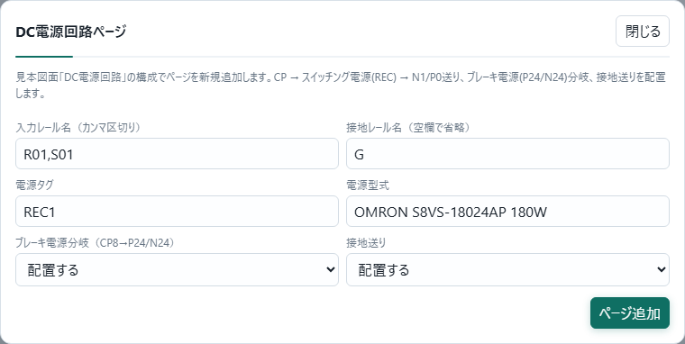{: .shot-wide}

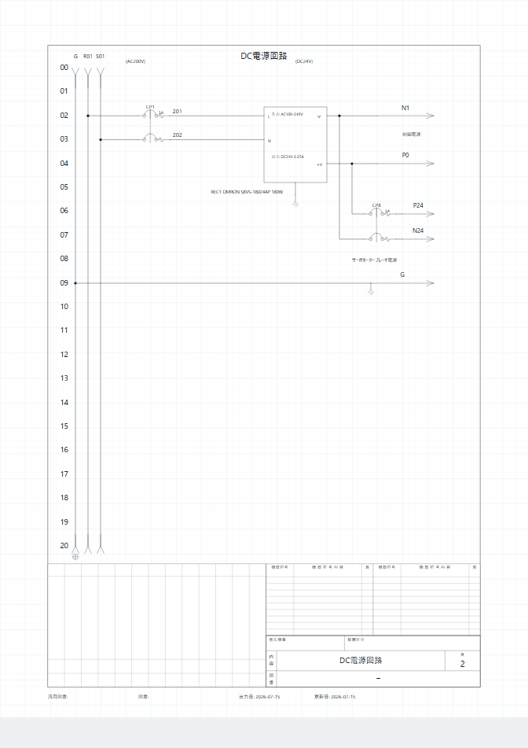{: .shot-full}

#### PLC電源回路

PLCベース名、カンマ区切りのスロット構成、運転準備/動力供給の接点タグ列を指定します。
`CP4 → P0A` とN1/GをPLCベースのDC+/DC-/接地へ接続し、N1（入出力COM）、
`CP5 → P1`（制御電源）、`CP6 + 接点列 → P3`（運転準備）、
`CP7 + 接点列 → P3M`（動力供給）を生成します。スロットは1〜8件、各接点列は最大4件、接点タグは
12文字以内です。接点タグ欄の空項目や末尾の余分なカンマは無視されます。スロット境界は60mmの領域を
2.5mm単位で配分し、型式名は区画内へ縦書き配置するため、7スロットなど等分できない件数でもグリッドから外れません。
分岐行は160/170/180/190mmへ10mm間隔で配置します。

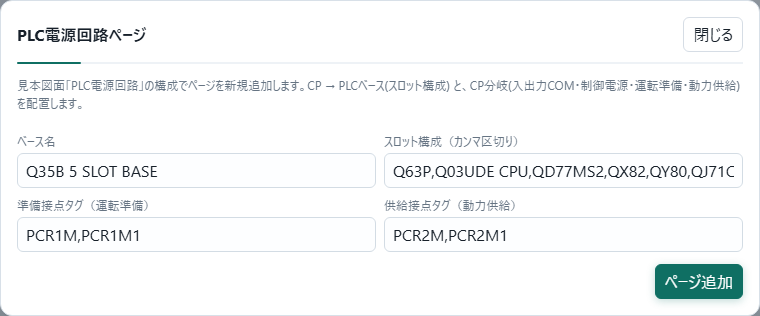{: .shot-wide}

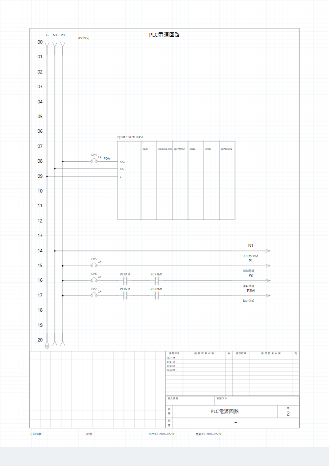{: .shot-full}

#### セーフティリレー回路

ユニットタグ、モニタリレータグ、2個の非常停止PB名称を指定します。既定ではPCR2E形ユニット、
縦連結2接点の非常停止PBを使うチャンネル1/2ループ、B-A短絡（オートリセット）、
13-14/23-24の安全出力、41-42からモニタリレーCR11へ至る回路、A1-A2電源を生成します。
テンプレート内の縦連結PBは接点段間10mmの専用形状で、4ピンすべてが2.5mm方眼上にあります。

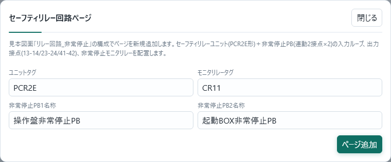{: .shot-wide}

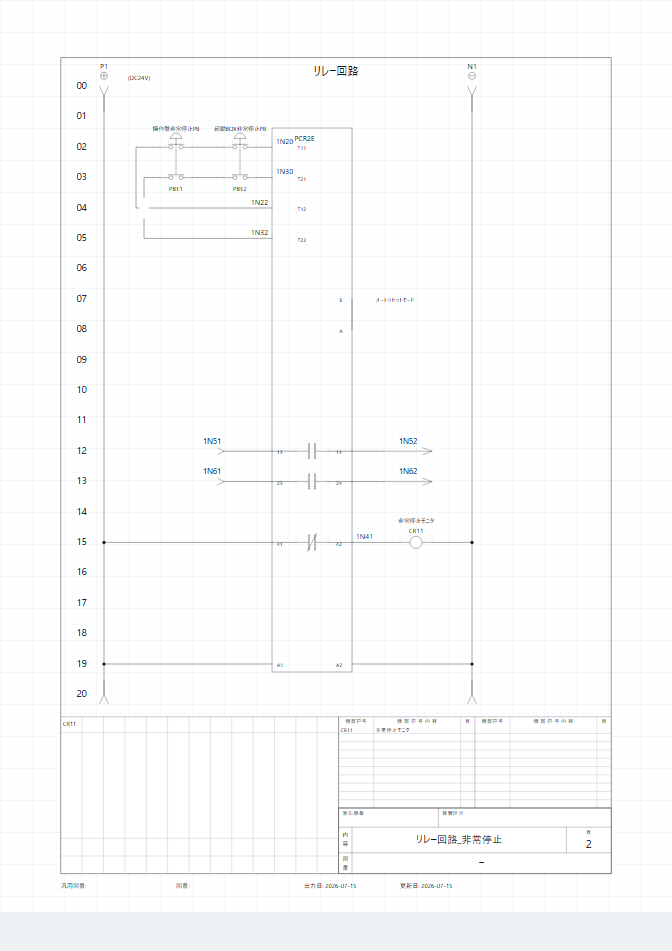{: .shot-full}

#### 一括生成

機能メニューの「一括生成」からは、次の回路を現在ページへ追加できます。

- ラング回路: 左レール → 直列接点 → コイル/ランプ → 右レールを行単位で生成します。
- 非常停止チェーン: 非常停止PBを直列にし、各局右側の境界端子、局間線番、線番付き送り矢印、
  同じPBの別接点から局内ループで接続する赤表示灯行、N1レール側の接続点、点線局枠を生成します。
- 電源投入回路: 切替スイッチ+入/切ポジション行と、準備PB+自己保持接点の並列行を生成します。
- ブレーキ/整流回路: 接点 → 整流器 → コイルの行を生成します。
- モータ分岐回路: 3極遮断器 → MC接点 → サーマル素子 → モータ+接地を生成します。
- PLCユニット: 16進連番を10mmピッチで並べた1〜19点のユニット列を生成します。
  19点でも下端は222.5mmとなり、設備標準図枠の機器符号表帯（224mm以降）へ入りません。
- ツイストペア: 2〜8本の導体、チェブロン、撚り交差、楕円束、シールド破線を生成します。
  信号名はチェブロン左へ右寄せで置かれ、左側レールと重なりにくくなっています。
  全長は20mm以上、導体ピッチは既定5mmです。スナップON時は開始X/Y、全長、導体ピッチを
  現在のグリッドへ自動で揃えます。モータ分岐回路の開始位置と全長も同様です。
- 盤レイアウト連携: タグ付き部品をフットプリントとして挿入します。

ラング回路、非常停止チェーン、電源投入回路、ブレーキ/整流回路は、現在ページの縦レール位置を
自動で実測して接続します。レールがないページでは左32.5mmのP1と右147.5mmのN1を自動追加してから接続し、
片側だけある場合は不足する側を補います。
旧版で作成した右146.5mmレールのページでも、その位置へ正しく接続します。

非常停止チェーンの局間線番は、末尾区間を基準名として手前へ `A`、`B`…を付けます。
たとえば3局のチェーン0は左から `Si0B → Si0A → Si0` となります。

{: .shot-wide}

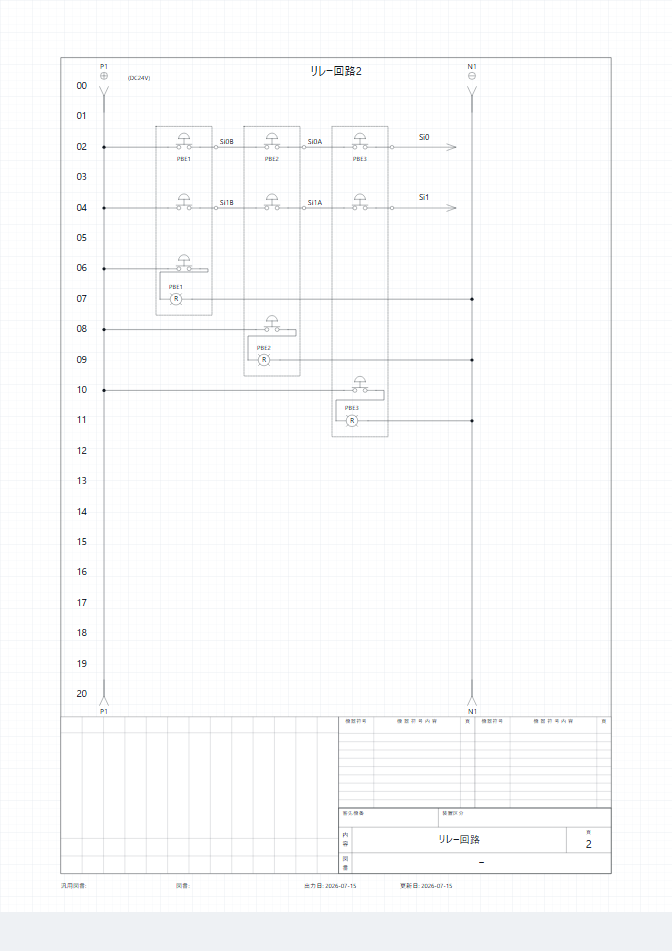{: .shot-full}

### 21.3 シンボル様式

主要シンボルは設備標準の形状で描画されます（SVG と DXF は同一定義から生成）。
設備標準/JIS/IECの意匠を保ちながら、接続ピン間隔は原則として2.5mmグリッドの倍数に
統一されています。手動配置用の一部多段記号は設備行に合わせた9.5mm形状を保持し、
ページテンプレートでは互換性を壊さない別の10mm形状へ自動で切り替えます。
必要な記号ではリード線や本体寸法も調整されています。

- a接点/b接点: 縦バー2本（bは斜線つき）、左右ピン間隔10mm。上段に機能説明（説明欄の1行目）、
  下段に参照番号を表示します。a接点の切替接点（c接点）は左の共通1ピンと右のNC/NO 2ピンを持ちます。
- コイル: 無印の円。下段に品番（電気属性の品番）を表示。
- 表示灯: 円+45°ヒゲ4本+色文字（右パネル「ランプ色文字」）。盤内照明用の箱形蛍光灯にも切替できます。
- 遮断器: 実測形/ELB/IEC形は左右ピン間隔12.5mm（「定格表示」に 10A などを入力）。
  旧データのアーチ形サーキットプロテクタも左右12.5mmです。端子円とアーチの描画順を修正し、
  アーチ線が端子円内へ突き抜けて見えないようにしています。既存データとの互換性のため形状は保持されますが、
  新規作図の選択肢は「実測形」へ統合しました。トリップを省略する場合は「円＋アーク（トリップなし）」を使います。
  多極時の機械連動線は各アーチ頂点へ接続し、縦向きでも接続点を維持します。
- 押しボタン: 通常/非常停止を右パネルで切替。非常停止の既定は、半円キノコ傘と
  押込みで開くb接点を組み合わせた一般形です。従来のひねり解除環つき設備標準形は
  「シンボルデザイン」で選択できます。
- サーマルリレー(○✕○)/サーマル素子(⊓)/圧力スイッチ/リミットスイッチ/切替スイッチ/
  モータ（円内タグ+端子小円）/接地（斜線ハッチ）/端子（小円のみ）/抵抗（バリスタ切替可）。
- 変圧器: 縦の巻線バー2本+タップ端子円（左=一次4端子、右=二次3端子）。
  左右の基準ピン間隔は15mm、上下の端子ラインは設備行ピッチ（9.5mm）間隔で、2行にまたがって配置します。
  上タップ（X=5/10mm）も主ピンの1行（9.5mm）上に載ります。
  「定格」に 500VA などを入力すると下部へ表示されます。
  AC受電テンプレートでは上下端子・上タップを10mm間隔にした専用形状を使います。
- コンセント: 半円形の標準形と、スロット2本+接地を持つ箱形を切り替えられます。
- 追加部品: サーマル素子、圧力スイッチ、ポジション表示（入/切）、極性マーク（⊕⊖）。
- 端子台: 既定は「ユニット列」（幅10mmの縦カラム+波形破断線+中央端子円）。右パネルで旧ピル形にも切替可能。
  PLCユニット列と端子台の端子円中心は、画面表示・吸着点・DXFで同じ座標を使います。波形破断線も
  SVG/DXFで同じサンプリング点列から描くため、出力形式によって形が変わりません。
- これらの固定形状シンボルは角ハンドルでのリサイズ対象外です（寸法は様式で固定）。

図21-16は、設備標準で使用頻度の高いシンボルを同じキャンバス上へ配置した見本です。
部品名だけで形を判断しにくい場合は、左パネルのパレット表示とこの図を見比べてください。

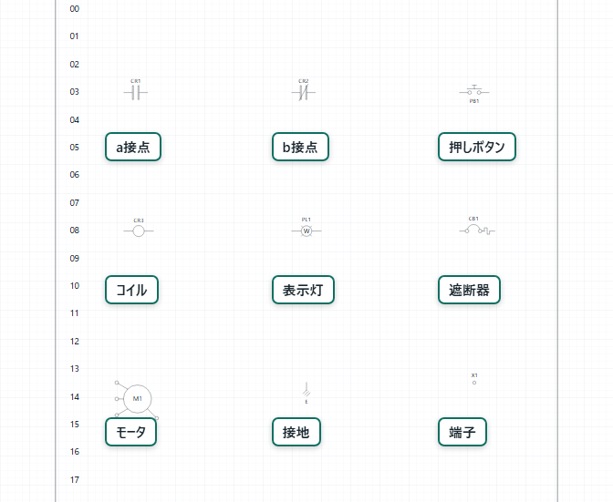{: .shot-wide}

### 21.4 シンボルデザインの切替

一部の部品は、同じ部品のまま**別デザインのシンボル**へ切り替えられます。
部品を選択し、右パネルの「シンボルデザイン」で選びます。
切替時は**第1接続ピンの絶対位置を保持**するため、接続済みの配線はずれません。
ピン間隔が共通のデザインでは、ほかの既存ピン位置も維持されます。照光式/パーム押しボタンなどは
本体寸法が変わり、非常停止の縦連結2/3接点、切替接点、ブリッジ整流などは追加ピンが現れますが、
いずれも第1ピンとそこへ接続した配線はその場に保たれます。

搭載デザインは合計100種類以上です。画面に表示される主な選択肢を次に示します。

#### 接点・操作スイッチ

| 部品 | デザイン（内部値） |
|---|---|
| a接点 | 縦バー（`standard`） / 円端子＋開き線（`jis`） / 斜め線のみ（`iec`） / 切替接点・c接点・1入2出（`changeover`） |
| b接点 | 縦バー＋斜線（`standard`） / 円端子＋閉じ線（`jis`） / 斜め線＋止め（`iec`） |
| 限時a・b接点 | オンディレー・縦バー（`standard`） / オフディレー・縦バー（`off`） / オンディレー・IEC斜線（`iec`） / オフディレー・IEC斜線（`iecOff`） |
| 押しボタン | 押しa接点（`standard`） / 押しb接点（`nc`） / JIS C 0617 a接点（`jis`） / JIS C 0617 b接点（`jisNc`） / 照光式・表示色はランプ色文字（`illuminated`） / パーム（`palm`） / 引き（`pull`） / ひねり（`twist`） |

#### 検出・選択スイッチ

| 部品 | デザイン（内部値） |
|---|---|
| 切替スイッチ | 2位置・設備標準（`standard`） / 入・切表示付き見本形（`onOff`） / 2位置・JIS C 0617（`jis`） / 3位置（`three`） / 鍵付き（`key`） |
| リミットスイッチ | 箱形NO（`standard`） / 箱形・下側NC/オーバーラン（`nc`） / ローラーレバーNO（`roller`） / ローラーレバーNC（`rollerNc`） |
| 圧力スイッチ | ダイヤフラム形（`standard`） / b接点（`nc`） |
| フロートスイッチ | a接点＋フロート（`standard`） / b接点＋フロート（`nc`） |
| 温度スイッチ | a接点・t°（`standard`） / b接点・t°（`nc`） |
| フロースイッチ | a接点＋流路パドル（`standard`） / b接点＋流路パドル（`nc`） |
| フットスイッチ | a接点＋踏板（`standard`） / b接点＋踏板（`nc`） |

切替スイッチの設備標準・3位置・鍵付きは、支点円とL字操作線を共通の基準座標で描き、
端子円の直前だけを意図した開放間隔にしています。入/切ポジション表示は透過枠と中央の操作軸を使うため、
背後の配線を枠面で隠しません。

「入・切表示付き（見本形）」は、標準2位置スイッチの右側へ、見本PDFと同じ「切」の縦線表示と
「入」の箱表示を一体で配置します。右パネルの「シンボルデザイン」から選択できます。
電気接続点はスイッチ本体の左右にあり、入・切表示は注記なので配線接続点にはなりません。
表示を個別に移動したい場合は、従来どおり「ポジション表示」部品を別々に配置してください。

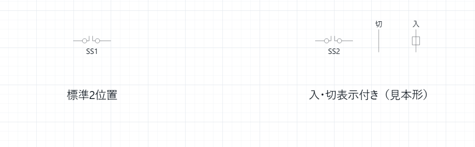{: .shot-wide}

#### 非常停止ボタン

非常停止ボタンの既定は `standard` です。旧版でデザインを指定せず保存した非常停止も、
読み込み後は新しい一般形で表示されます。以前の見た目へ戻す場合は `facility` を選びます。

| 値 | 表示名 | 用途・特徴 |
|---|---|---|
| `standard` | キノコ＋b接点（一般形） | 新しい既定。半円キノコ傘と押込みで開くb接点 |
| `jis` | キノコ＋b接点（JIS C 0617） | JIS C 0617（IEC 60617）様式。キノコ操作部、機械連動破線、IEC様式b接点（斜め可動線＋止め棒） |
| `multi2` | 縦連結2接点（連動） | 一般形を9.5mm行ピッチで2段連結。左右計4ピン |
| `multi3` | 縦連結3接点（連動） | 一般形を9.5mm行ピッチで3段連結。左右計6ピン |
| `jisMulti2` | JIS縦連結2接点（連動） | JIS C 0617（IEC 60617）形を2段連結。機械連動破線、左右計4ピン |
| `jisMulti3` | JIS縦連結3接点（連動） | 同じJIS/IEC形を3段連結。機械連動破線、左右計6ピン |
| `facility` | キノコ＋ひねり解除環（設備標準） | 旧既定。ひねり解除環とR表示を持つ設備標準形 |
| `bar` | バー押込式 | バー操作部を持つ従来形 |

縦連結形は、1つのキノコ操作部で同時に動作する複数接点を1シンボルとして表すために使います。
表示順は `standard → jis → multi2 → multi3 → jisMulti2 → jisMulti3 → facility → bar` です。
セーフティリレーページの自動生成時だけ、見た目を共有する10mm段ピッチ版へ置き換えます。

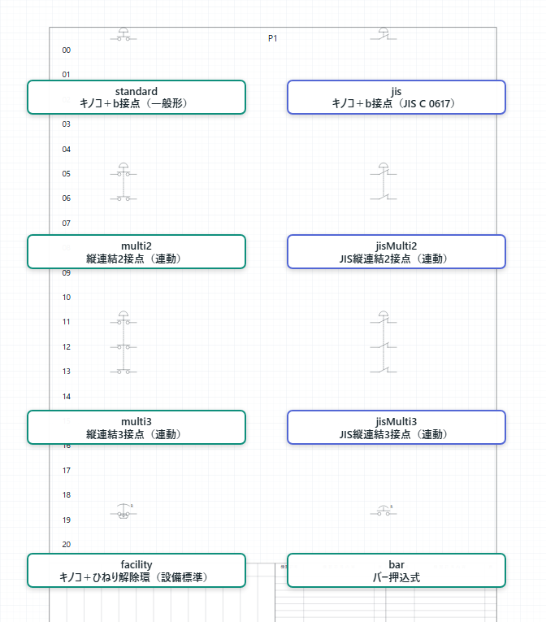{: .shot-wide}

パレットで「非常停止」を検索すると、非常停止ボタンを直接配置できます。配置直後は一般形が選ばれ、
右パネルの「シンボルデザイン」から8種類を切り替えられます。

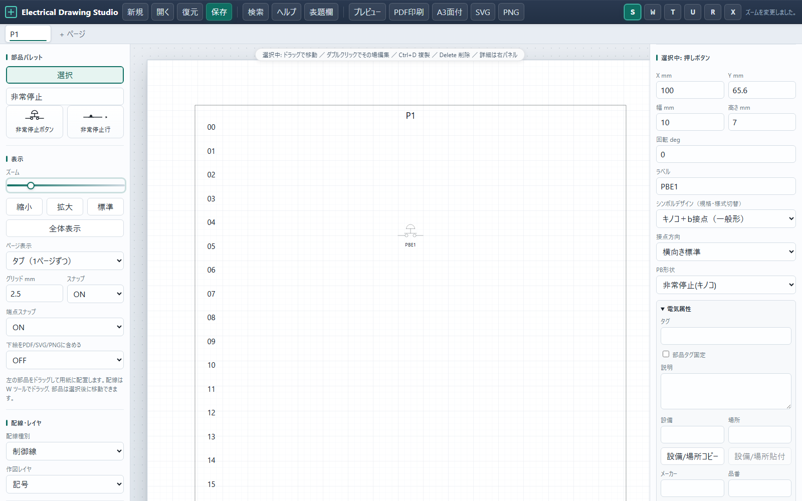{: .shot-full}

#### コイル・保護・受動部品など

| 部品 | デザイン（内部値） |
|---|---|
| コイル | 円（`standard`） / 箱形（`box`） / 交流・円＋〜（`ac`） / ラッチ・箱＋斜線（`latch`） / 限時T（`timer`） / カウンタC（`counter`） / フリッカF（`flicker`） / 盤間中継・小四角2連（`interface`） |
| 接地 | 斜線ハッチ（`standard`） / 横棒3本（`bars`） / 清浄接地（`circle`） / シャーシ接地・櫛形（`chassis`） |
| ヒューズ | 箱＋貫通線（`standard`） / 箱のみ（`blank`） / S字・旧JIS（`wave`） |
| 遮断器 | 実測形（`standard`） / 円＋アーク・トリップなし（`arc`） / 配線用遮断器・箱形（`mccb`） / 漏電E表示（`elb`） / ×＋開き線IEC（`iec`） |
| サーマルリレー | ○✕○（`standard`） / 箱形・内部⊓（`box`） |
| 計器 | 円形（`standard`） / 角形（`box`） / 二重円・積算計（`double`） / 円＋目盛弧＋針（`needle`） |
| モータ | 円（`standard`） / 二重円・発電機等（`double`） |
| 変流器 | 円CT（`standard`） / 二重円ZCT（`zct`） / 貫通線＋コブ2・旧JIS（`coil`） |
| 変圧器 | 巻線バー＋タップ（`standard`） / 二巻線円形JIS（`circles`） / 二巻線円形＋鉄心JIS（`circlesCore`） |
| リアクトル | コブ3個（`standard`） / 鉄心入り（`core`） / 箱形IEC（`box`） |
| ヒータ | 箱＋斜線（`standard`） / 箱のみ・JIS抵抗器形（`plain`） |

#### 受動部品・半導体・表示

| 部品 | デザイン（内部値） |
|---|---|
| ダイオード | 標準（`standard`） / LED（`led`） / ツェナー（`zener`） / サイリスタ（`thyristor`） / ブリッジ整流・4端子（`bridge`） |
| 避雷器 | 箱＋矢印（`standard`） / ギャップ形・対向三角（`gap`） |
| コンデンサ | 平行板（`standard`） / 有極（`polarized`） / 可変・貫通矢印（`variable`） |
| 抵抗 | 標準枠（`box`） / バリスタ（`varistor`） / 可変（`variable`） / サーミスタ（`thermistor`） / ジグザグ・旧JIS（`zigzag`） |
| バッテリ | 2セル（`standard`） / 単セル（`single`） |
| トランジスタ | NPN（`npn`） / PNP（`pnp`） |
| 論理ゲート | AND（`and`） / OR（`or`） / NOT（`not`） / NAND（`nand`） / NOR（`nor`） / XOR（`xor`） |
| ランプ | 丸形パイロット（`pilot`） / 円＋✕IEC（`cross`） / 筒形表示灯（`cylinder`） / 蛍光灯・盤内照明（`fluor`） |
| ブザー | ホーン（`horn`） / スピーカー（`speaker`） |
| 端子 | 丸（`circle`） / 二重円・貫通（`double`） / 角（`square`） |
| コンセント | 半円＋差込口（`standard`） / 箱形・スロット2本＋接地（`box`） |
| センサ | 汎用（`standard`） / 誘導形近接（`inductive`） / 光電（`photo`） / 静電容量形近接（`capacitive`） / 磁気・リード（`magnetic`） |
| ソレノイド弁 | 単ソレノイド（`standard`） / 両ソレノイド方向切替（`double`） |
| 電源 | 直流電源＋/－表示（`standard`） / AC/DC変換器（`acdc`） / DC/DC変換器（`dcdc`） |

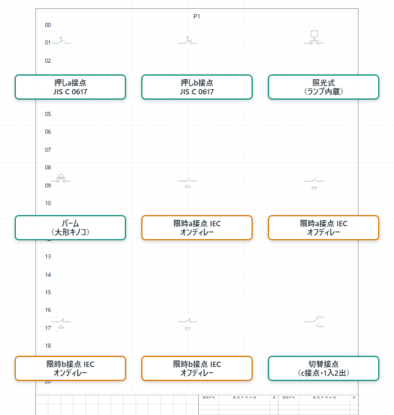{: .shot-wide}

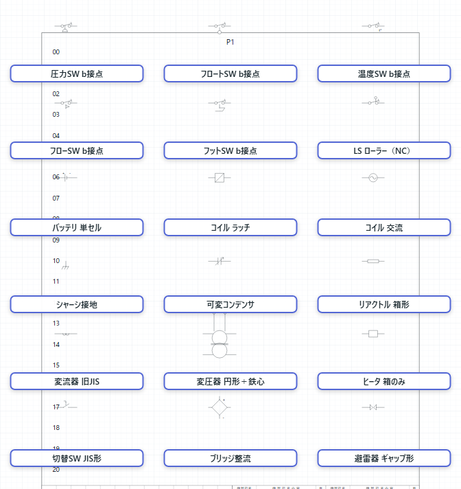{: .shot-wide}

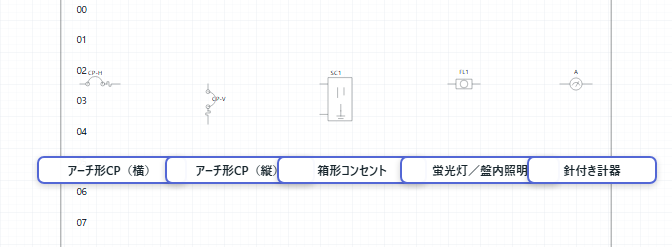{: .shot-wide}

> 💡 **ヒント:** モータ記号のラベルを `G` にすれば発電機、計器のラベルを `V`/`A`/`W` に
> すれば電圧計/電流計/電力計として使えます（円＋文字のJIS様式）。
> 保護継電器（OC/GR等）も同様に計器記号＋機能文字で作図するのがJIS流です。
> バリエーションを持つ部品は、配置直後のステータスバーにも案内が表示されます。

**JIS網羅の範囲について:** シーケンス図・動力回路図・盤内配線図で常用される
JIS C 0617系の記号（接点各種／操作スイッチ類／保護器具／変成器／回転機／表示・警報／
受動素子・半導体／接地各種／論理ゲート）を標準搭載しています。
建築電気設備図記号（JIS C 0303）や通信・特殊半導体などの稀な記号が必要な場合は、
シンボルビルダー（15章）で同じ寸法規律のまま追加登録できます。

センサ、両ソレノイド弁、電源変換器の追加デザインも固定寸法の単一定義を使用します。
画面SVG、DXF、配線接続点は同じ座標から生成され、左右リードは本体外形または端子位置で止まるため、
本体内部へ不要にはみ出しません。シンボル定義全体は、非数値座標、ゼロ長線、連続重複点、
負またはゼロ寸法を自動テストで検査しています。

バリエーションを持つ部品は、配置直後のステータスバーにも切替案内が表示されます。
複数選択後に「同種を全選択」を使えば、同じ種類のシンボルデザインを一括変更できます。

### 21.5 配線接続点とグリッド

部品を配置すると、**最初の接続ピンがクリックした行・グリッドに正確に一致**するよう自動調整されます
（ピンが部品枠の中心に無い押しボタン・箱物などでも、配線の高さがずれません）。
端子台とコネクタは先頭端子ノードが基準です。移動時の行スナップも同じ基準で働きます。

#### 基本ルール

- X座標: 配線端点、部品の第1ピン、タップ縦線、箱の辺を2.5mmグリッドへ配置します。
- Y座標: パレットからの手動配置・移動では設備行 `27 + 9.5×行番号` mmへ磁気スナップできます。
  ページテンプレートの新規生成では行番号を参照表示にとどめ、接続点と配線を2.5mmグリッドへ配置します。
- 端子小円: 円の**中心**をグリッド点へ置き、配線を円中心まで届かせてから白抜き円で覆います。
  円の手前で配線が止まる微小な隙間は発生しません。
- ツイストペア: スナップON時は開始X/Y・全長・導体ピッチを現在のグリッドへ揃え、
  チェブロン端点、撚り交差線、シールド破線、楕円束の中心もグリッドへ整合します。
  交差線は束マークから2.5mm内側、シールドは導体の上下2.5mm、楕円束は幅4mmです。

#### 接続ピンの正規化

接続ピン間隔は原則として次のように2.5mmの倍数へ統一されています。
意匠を保ってリード線を延長した記号に加え、グリッド整合のため本体幅・既定寸法も変更した記号があります。

| 記号 | 現在の接続寸法 |
|---|---|
| a/b接点、限時接点、サーマルリレー、サーマル素子 | 左右ピン間隔10mm |
| 遮断器 | 実測形/円＋アーク/箱形MCCB/ELB/IEC形はいずれも左右12.5mm |
| 接点ブロック | 左右ピン間隔15mm |
| 変圧器 | 手動配置形: 左右15mm、上下9.5mm、上タップ9.5mm上。ACテンプレート形: 上下・上タップ10mm |
| モータ/発電機 | 相端子ピッチ5mm、接地ピンは第1ピンからX/Yとも12.5mm |
| ブザー、ファン | 幅15mm |
| ソレノイド弁、センサ、電源 | 幅25mm / 25mm / 35mm |
| 機器箱、端子箱 | 30×25mm / 22.5×15mm |
| 箱形コンセント | 手動配置形: 上下9.5mm。ACテンプレート形: 上下10mm |
| 非常停止の縦連結2接点 | 手動配置形: 段間9.5mm。セーフティテンプレート形: 段間10mm |

9.5mm形状は既存図面と手動配置の互換用です。ページテンプレートは専用10mm形状を使うため、
機械連動線の弧頂点など電気接続ではない描画点を除き、全接続点が2.5mm方眼へ載ります。

#### テンプレートの基準位置

テンプレートと一括生成も同じ規則で整合しています。代表的な基準値は次のとおりです。

| 対象 | 現在の基準位置・ピッチ（mm） |
|---|---|
| 設備ラダー | 左レール32.5（複数時は+5）、右レール147.5、母線端30/217.5、矢印基点35/212.5 |
| PLC入力回路 | フィーダ縦線47.5、端子中心130、先頭行37.5・行ピッチ10 |
| ラング回路 | 終端コイル135、接点位置 `45 + 17.5×k`（k=0,1,…） |
| 非常停止チェーン | 1〜3局は `52.5 + 27.5×局番号`、4局は37.5開始・27.5ピッチ、局右端子中心は局位置+15 |
| 汎用ラダー | 左右母線35/175、開始55、部品ピッチ15 |
| インターロック | 枠37.5/105/117.5/175、下端217.5、境界端子中心102.5、信号Y=`45 + 17.5×行番号` |
| AC電源回路（受電・分岐） | G/相レールX=30/35/40/45、母線下端217.5、2線分岐ピッチ10 |
| AC電源回路（モータ・サーボ） | G/相レールX=30/35/40/45、CB55、MC85、アンプ左右105/140。L11/L12タップ交差には非接続ギャップ |
| AC電源回路（モータ・インバータ） | タップ70/72.5、MC120、サーマル130、端子中心147.5、モータ第1ピン155 |
| DC電源回路 | G/入力レールX=30/35/40、REC左右105/130、入力Y=45/55、送り矢印終端172.5 |
| PLC電源回路 | G/N1/P0レールX=30/35/40、PLCベース左右75/150、分岐Y=160/170/180/190 |
| セーフティリレー | 非常停止入力Y=45/55/65/75、出力Y=140/150、モニタY=170 |
| ツイストペア | 既定導体ピッチ5、チェブロン長5 |
| モータ分岐 | 既定全長95、主要機器の送り+5/+22.5/+17.5 |

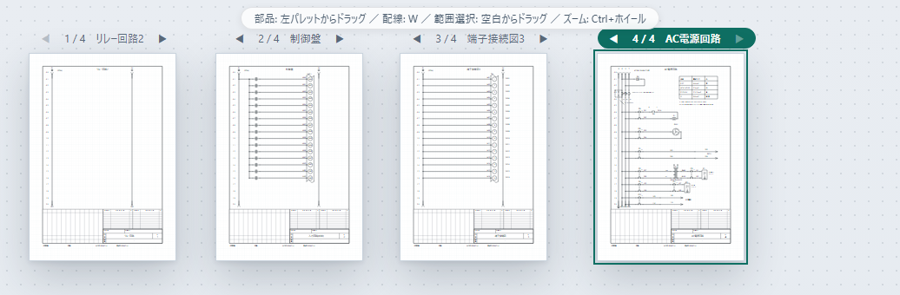{: .shot-wide}

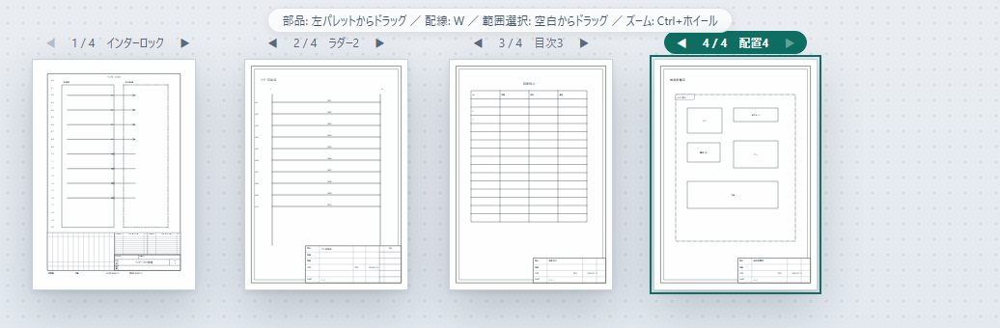{: .shot-wide}

AC電源回路（受電・分岐）ではG/相レールを5mmピッチへ揃え、ELBと各2極CPを機械連動線で
接続しています。AC電源回路（モータ・インバータ）では3相ピッチも5mmに統一し、
ブレーキ接点は45/55mm起点の10mmピッチ、
コイル行は接点行の5mm上へ配置します。MC接点右ピンとサーマル左ピンはX=130mmで直結し、
3極遮断器の機械連動破線は各極中心に最も近い左基準+5mmのグリッド線へ配置します。
整流器箱と次のブレーキ回路配線が重ならないよう上下に2.5mmの余白を確保しています。
AC200V/100V、サーボ2軸/1軸、インバータ、DC、PLC電源、セーフティ、PLC入出力、端子接続図、
インターロック、汎用ラダー、目次、機器配置を実ブラウザで再生成し、文字同士の重なりがないことを
確認しています。自動テストでは全15テンプレートの接続ピン、配線端・屈曲点、接続箱、端子円中心を
厳密な2.5mm方眼で検査し、SVG/DXF形状、非接続交差、入力上限、
schemaVersion 4への冪等な移行を検査します。旧JSONの互換補修は§16.2を参照してください。

## 22. クロスリファレンス（自動参照番号）

リレー回路では「コイル CR1 を励磁すると、別の場所にある CR1 の接点が動く」というように、
**同じ機器のコイルと接点が図面のあちこちに分かれて**描かれます。
クロスリファレンスは「その接点の親コイルはどのページの何行目にあるか」を
自動で表示し合う仕組みです。図面を追いかける手間が大きく減ります。

使い方は簡単で、**コイル（親）と接点（子）に同じタグ**（例: `CR1`）を付けるだけです。

- 参照アドレスは「頁番号+行番号2桁」（例: 頁2 行05 → `205`）。
- 接点の下に親コイルの位置が自動表示されます（右パネル「参照番号」で手動上書き可）。
- 設備標準図枠では、左下表にコイルごとの接点位置一覧（b接点は下線つき）、
  右下表に機器タグ一覧が自動記入されます。
- 「クロス参照」ダイアログに「コイル→接点」一覧が追加され、位置ボタンでジャンプできます。
- 線番書式・部品タグ書式で `%R`（行番号2桁）が使えます。例: `%S%R` → `205` 形式。
- 監査に、接点のないコイル/コイルのない接点/a・b接点の使用数上限超過
  （部品カタログの上限、既定4）が追加されています。

図22-1では、`CR1` と `CR2` について親コイルと子接点のアドレスを同じ行で確認できます。
「位置」ボタンで実物へ移動し、タグが正しい組み合わせになっているかを検図します。

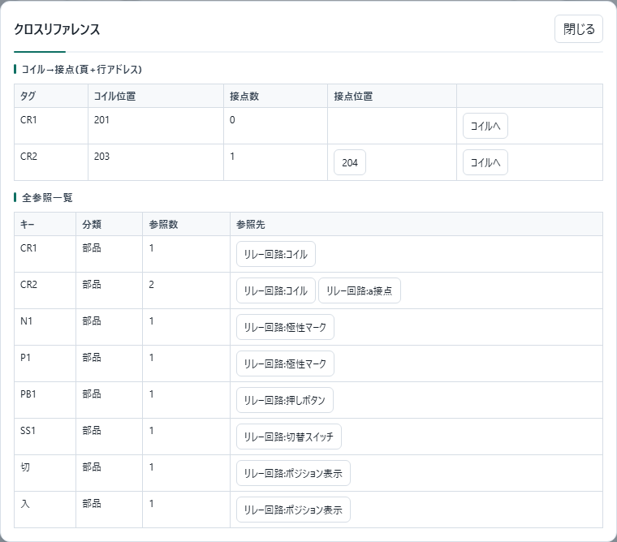{: .shot-wide}

## 23. 部品カタログとBOM

- 機能メニューの「部品カタログ」: メーカー/品番/定格/接点上限をプロジェクト内に登録できます。
  - 「サンプル追加」: 汎用の品目サンプル（リレー/プロテクタ/表示灯など8件）を投入します。
  - 「CSV取込」: family/manufacturer/catalog/description/rating/maxNO/maxNC 列（日本語見出し
    「種別/メーカー/品番/説明/定格/a上限/b上限」も可）のCSV/TSVを取り込みます。
    品番が一致する行は上書き、それ以外は追加されます。
  - 「CSV出力」: 登録内容を catalog.csv として書き出します（Excelで開ける形式）。
- 部品選択中に電気属性の「カタログから選択」を押すと、登録済みカタログを適用できます。
- 機能メニューの「部品集計表(BOM)」: メーカー×品番×種別で数量集計し、CSV出力または表として挿入できます。

BOMを正しく集計するには、同じ購入品へ同じメーカー名・品番を入力します。
図23-1で数量とタグ一覧を確認し、提出用ならCSV、図面へ載せるなら「表として挿入」を選びます。

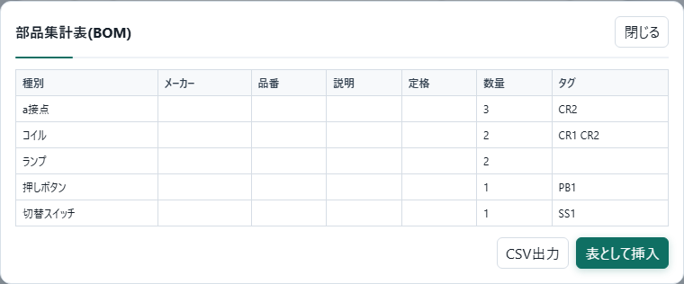{: .shot-wide}

## 24. その他の追加機能

### 24.1 ケーブル・芯線エディタ

機能メニューの「ケーブル・芯線エディタ」では、ケーブルタグと芯番号を組にして、芯色、線径、使用／予備、From、To、シールド有無を管理できます。図面に同じタグのケーブルマーカーがある場合は、適用時に芯線情報がマーカーへ反映されます。ケーブルマーカーには `ケーブルタグ` と、`芯番号/芯色/線径` が2段で表示されます。

### 24.2 設置場所・接続ビュー

「設置場所・接続ビュー」は、タグ付き部品を設備・場所順に一覧化し、部品種別、ページ、接続している線番を表示します。「表示」を押すと対象ページへ移動して部品を選択します。設備・場所が部品に未設定の場合はページ設定値を使用します。

### 24.3 端子台エディタ強化

端子台エディタでは従来項目に加え、端子順、予備端子、アクセサリ、盤内／盤外接続区分を編集できます。端子順はカンマ区切りで入力し、図面上の端子名の順番へ反映します。ジャンパは従来どおり `1-2;3-5` 形式です。

### 24.4 盤レイアウト双方向同期

盤レイアウト連携画面には「回路図→盤」と「盤→回路図」があります。「回路図→盤」はタグ、メーカー、品番、説明、設備、場所を盤フットプリントへ更新します。「盤→回路図」は盤側で編集したメーカー、品番、説明、設備、場所を元の回路図部品へ戻します。対応付けには盤フットプリントの「回路図タグ参照」を使用します。

### 24.5 PLCモジュールDB

「PLCモジュールDB」には、名称、メーカー、型式、入力／出力、開始アドレス、点数、電源端子を登録できます。登録内容はPLC入出力回路ページのモジュールプリセットに追加されます。開始アドレスからの連番は16進で生成されます。

### 24.6 DINレール／配線ダクト

「DINレール／配線ダクト」で種類、長さ、配置X/Yを指定すると、盤レイアウト用の外形を生成します。DINレールには10mm間隔の取付穴、配線ダクトには破線外形が付きます。生成後は通常の図形と同様に移動、寸法変更、複製できます。

### 24.7 線番の自動衝突回避

線番が部品外形と重なる場合は、上下方向に最大20mmまで自動退避します。元の位置から移動した線番には細いリーダー線が表示されます。手動位置を優先するデータでは自動退避を行いません。

### 24.8 ユーザー回路登録

再利用したい回路を選択し、「選択範囲をユーザー回路登録」を実行して名前を付けます。「ユーザー回路を挿入」で登録名と配置X/Yを指定すると、構成要素を新しいIDで複製して現在ページへ挿入します。登録回路はプロジェクトJSONへ保存され、挿入画面から削除できます。

### 24.9 高速作画支援

- **コマンドパレット**: `Ctrl+K`で開き、部品名または機能名を入力してEnterで実行します。
- **直前操作の繰り返し**: 選択ツール中にEnterまたはSpaceを押すと、直前の部品配置または複製を再実行します。
- **連続配置**: 初期状態では部品を配置しても同じ配置ツールを維持します。Escで終了します。「お気に入り設定」で1回配置へ変更できます。
- **スマート複製**: `Ctrl+D`または配列複写でタグ、線番、ケーブル芯番号、PLCアドレス末尾を自動増分します。固定属性は変更しません。
- **属性スポイト**: 元要素を選択して開始し、適用先を連続クリックします。メーカー、品番、定格、設備、場所、線種、レイヤ、向きなどを転写します。Escで終了します。
- **お気に入り**: よく使う部品と回路をパレット先頭の「★ お気に入り」へ固定します。
- **配線中キー操作**: `1`～`4`で4つの折れ形状、Tabで次形状、`R`で始終反転、`A`で直交／任意角度、`N`で長さ・角度の数値確定、`J`で終点へ接続点を置いて確定します。
- **配線上への部品挿入**: 接点、端子、ヒューズ等を既存配線上へ置くと、配線を左右の接続点で自動分割します。
- **重なり選択**: Altを押しながら同じ場所をクリックすると、重なった部品・配線・文字を順番に選択します。
- **一括編集**: 選択要素のタグ／線番、説明、メーカー、品番、設備、場所を表形式で連続編集します。
- **クイックプロパティ**: `Q`でタグ／線番、回転、レイヤ、説明だけを小さな編集画面で変更します。
- **配列ライブプレビュー**: 等間隔複製の個数とX/Y間隔を変更すると、確定前の配置イメージを表示します。
- **接続点スマート整列**: 複数部品の第1配線接続点を、先頭部品と同じYへ揃えます。
- **ナビゲーション履歴**: 検索、監査、クロスリファレンス等で移動した位置をAlt+左右キーで戻る／進むことができます。
- **自動保存・復旧**: 操作確定ごとにブラウザ内バックアップを更新し、約5分間隔で3世代を保持します。上部の復元ボタンから任意世代へ戻せます。

### 24.10 プロジェクト一括更新

機能メニューの「プロジェクト一括更新」では、部品タグ再採番、線番更新、接続点生成、ページ番号・総頁数、盤フットプリント同期、最終監査を選択し、決めた順序でまとめて実行できます。大きな編集の後や出図前の整合処理に使用します。

### 24.11 シンボル一括置換

置換元シンボルを選択し、置換先と対象範囲（選択要素／現在ページの同種／全ページの同種）を指定します。タグ、説明、メーカー、品番、設備、場所、回転、ラベル位置を維持し、旧接続点に接続されていた配線端を新シンボルの対応接続点へ移します。

### 24.12 表計算データ往復編集

部品、端子、PLC、配線のデータをTSV形式で表示・保存できます。Excel等へ貼り付けて編集し、戻した後に「変更を確認」を押すと、要素IDを基準に変更件数と内容をプレビューします。ID、ページ、種別は照合用なので変更しないでください。適用対象は既存要素だけで、新しい図形は生成しません。

### 24.13 カタログ差分更新

部品カタログの品番を基準に全ページを照合し、メーカー、説明、定格、接点上限などの差分を一覧表示します。「すべて更新」で使用中部品へ最新のカタログ値を再適用します。

### 24.14 端子単位詳細

端子台エディタの「端子単位詳細」では、端子番号と段ごとに表示名、端子型式、盤内接続、盤外接続、最大接続線数、ジャンパ、予備を管理できます。多段端子は段ごとに独立した行を持ち、1段目の表示名は図面上の端子名へ反映されます。

### 24.15 フットプリント検索DB

メーカー、品番、回路図種別と、盤フットプリント名・幅・高さの対応を登録します。盤レイアウト連携で部品を挿入するときは、固定の既定寸法よりこのDBの一致項目を優先します。

### 24.16 項目番号・バルーン・銘板

現在ページの盤フットプリントへ開始番号から項目番号を付け、引出線付きバルーンを生成します。必要に応じてフットプリント下へ回路図タグを記載した銘板も生成します。再生成時は以前の自動注記を置き換えます。

### 24.17 ケーブル展開（ファンイン／ファンアウト）

ケーブルタグ、芯数、左右位置、開始Y、芯間隔を指定すると、多芯ケーブルの個別配線、中央ケーブルマーカー、芯線DBをまとめて生成します。シールドをONにすると各芯へシールド属性を設定し、ドレン線も追加します。

### 24.18 高速作画UIと操作支援

- **クイックリボン**: 作図、繰返し、回転、複製、削除、検査表示、ページ一覧、コマンド検索を画面上部から直接実行します。
- **集中表示**: `Tab`または「集中表示」で左右パネルを同時に隠します。左右端の矢印ボタンでは片側だけ開閉でき、状態はプロジェクトへ保存されます。
- **状況別ミニツールバー**: 選択対象の近くに、配線開始、回転、複製、編集、線番、曲げ、分割、削除など対象に合う操作だけを表示します。
- **端子からの配線**: `W` で配線ツールを選んでから端子の接続点をドラッグします。選択ツール中のクリックやドラッグは選択・移動だけを行います。
- **スマート配線候補**: 配線中は部品外形との交差が少ないL字／コの字経路を優先します。Tabまたは`1`～`4`で別候補へ切り替えます。
- **数値直接入力**: 配線・直線のドラッグ中に `30,45` と入力してEnterを押すと長さ30mm・角度45°、`120@75`なら絶対座標X=120、Y=75で確定します。従来の`N`入力画面も利用できます。
- **スナップフィードバック**: 作図中の終点に吸着マーク、長さ、角度を表示します。下部HUDにはツール、グリッド、スナップ、接続スナップ、選択数を常時表示します。
- **等間隔連続配置**: 同種部品を2個置いた後、予測位置の近くへ3個目以降を置くと、直前の間隔を維持して配置します。
- **配線経路の追従**: 接続済み部品を移動すると端点だけでなく直交経路を組み直します。既存配線へ終点を吸着した場合は接続点も自動生成します。
- **ショートカット設定**: 選択、配線、文字、直線、矩形、円、クイックプロパティの単一キーを変更できます。重複割当は保存できません。
- **強化コマンドパレット**: `Ctrl+K`で部品と機能をあいまい検索し、よく実行する項目を上位表示します。
- **ページナビゲータ**: 全ページをサムネイル表示します。クリックで移動し、カードのドラッグ＆ドロップでページ順を変更します。
- **図面上のエラー表示**: クイックリボンの「検査表示」で未接続、未採番、重複などの対象へ赤い`!`を表示します。マーカーにマウスを置くと内容を確認できます。
- **安全通知**: 要素削除後は右下通知の「元に戻す」から直前状態へ戻せます。大規模な更新機能では従来どおり差分または件数を確認してから適用します。

- 配線: 線番位置（中央/始点/終点+微調整）、「配線を分割」、2本選択で「配線を結合」、
  「終点を延長」（軸方向に伸ばし最初に交差する配線へ接続）、「終点をトリム」（最初の交差まで切り詰め）。
- 信号矢印: スタイル（開き/塗り/フォーク/シェブロン）と始点側矢印。
  発信元/受信先の同名ペアには相手の頁番号が自動注記されます。
- 端子台ジャンパ: `1-2;3-5` 形式で渡り弧を表示（端子台エディタでも編集可）。
- 直線の線種プリセット（一点鎖線ほか）と波形（破断線）形状、文字の下線、表の斜線セル（`行,列;行,列`）。
- 矩形/円の塗りつぶし（なし/白=下を隠す/黒）。ユニット外形や塗り端子の表現に使えます。
- 複数選択: グループ化/解除（クリックでグループごと選択）、左右ミラー、等間隔複製（既定Y=9.5mm）、
  全体回転（左右90°）、所属レイヤ/配線種別の一括変更。
- 機能メニューの「目次生成（全ページ一覧）」: 基本図枠に見出し「図面目次」と、
  全ページの No./図番/図名/ページ名をまとめた表（要素）を配置した目次ページを自動生成します。
- 帳票CSVの配線行には `net=頁-連番`（同電位ネットID）と、ネットに接する信号矢印の
  `signal=ラベル` が出力されます。
- 機能メニューの「ネットリスト（ページ間統合）」: 同電位ネットを一覧し、同じ信号矢印
  ラベルに接するネットはページをまたいで1グループに統合して表示します（CSV出力可）。
- ユーザー部品管理には各部品の**プレビュー**と**改名**ボタンがあります。
  配線を接続したい回路は、端子や接点を含めて登録すると接続点として機能します。
- 機能メニューの「シンボルビルダー（マウス作図）」: **方眼キャンバスにマウスで直接作図**して
  オリジナル部品を作成できます。直線・矩形・円・**楕円**はドラッグ、**円弧**は中心から弧の始点へ
  ドラッグ（90°で作成→ハンドルで調整）、文字・接続点（赤丸=配線が吸着）はクリックで配置。
  スナップは1／0.5／0.25mmから選択。
- ビルダーの**変形ハンドル**: 選択ツールで図形をクリックすると、移動に加えて
  **青□ハンドル**（直線=端点、矩形=四隅、円/弧=横半径・縦半径）と
  **橙○ハンドル**（弧の開始角/終了角、5°刻み）で後から形を変えられます。
  円の半径ハンドルを片方だけ動かすと**楕円**に、円弧も同様に**楕円弧**になります。
  文字は選択して「文字内容」欄で書き換えられます。
  キャンバスの内容は下段の**スクリプト定義**
  （`line/rect/circle/ellipse/arc/earc/text/anchor`）と常に同期しており、
  細かい座標はスクリプト側で直接打ち込むこともできます（どちらで編集しても同じ）。
  ユーザー部品管理の「編集」から、登録済み部品（スクリプトで表現できるもの）を
  同じビルダーで開いて上書き保存できます。回路スニペット（接点等を含む登録）は改名/削除のみです。

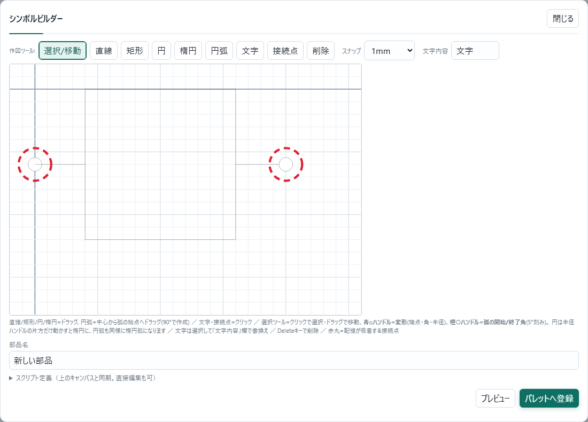{: .shot-wide}

- 機能メニューの「改訂履歴」: 改訂記号・日付・内容をプロジェクトに記録します。
  図枠「詳細: 右下+改訂欄」の改訂欄へ最新5件が表示され、最新の改訂記号は表題欄一括更新の既定値になります。
- 標準パック出力/取込（機能メニュー）: 線番書式・タグ規則・配線種別・レイヤ・監査ルール・
  ユーザー部品・部品カタログを JSON として入出力。取込時、ユーザー部品は同IDをスキップ、
  カタログは品番一致を上書きして統合します。ユーザー部品テンプレートや表題欄レイアウトを
  含む全項目を取込前に検査し、不正なパックは現在の設定を変更せず中止します。
- DXF取込（機能メニュー）: LINE/CIRCLE/ARC/TEXT/LWPOLYLINE を要素として取り込み（トレース用。ARCは折れ線近似）。

## 25. 注意事項

- 再編集用には必ず JSON を保存してください。
- 下絵に使用したスキャン画像やPDFは配布物・リポジトリへ含めないでください。
- トヨタ標準の具体仕様が確定したら、専用の標準パックとして追加します。

## 26. チュートリアル: はじめてのリレー回路図

この章では、押しボタンでリレーを動かしランプを点ける簡単な回路図を、
ページ作成から印刷まで通しで作ります。所要時間は15分程度です。
初めての方は、実際にツールを開いて手を動かしながら読み進めてください。

完成する回路のイメージ:

図26-1の1行目は `PB1` でコイル `CR1` を動かす回路、2行目は `CR1` のa接点で
表示灯 `PL1` を点灯する回路です。線番と接点下のクロスリファレンスも自動反映されています。

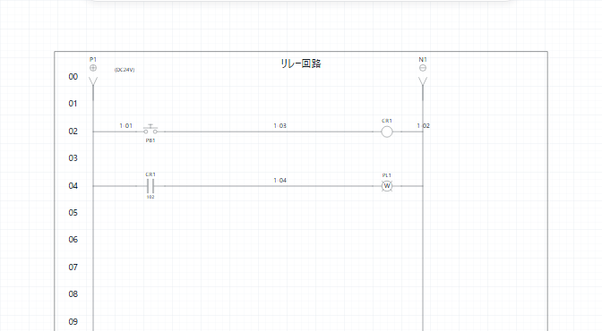{: .shot-full}

### 手順1: ラダーページを作る

1. 右パネルの「テンプレートからページ追加」で **「設備ラダー」** を選びます。
2. ダイアログが開きます。そのまま既定値（左レール `P1`、右レール `N1`）で
   「ページ追加」を押します。
3. 行番号 00〜20 付きの図枠と、左右の縦レールが入ったページが追加されます。

**うまくいかないとき:** ダイアログが出ない場合は、プルダウンが「選択してください…」に
戻っているか確認して、もう一度選び直してください。

### 手順2: 1行目の部品を置く（押しボタンとコイル）

1. 左パレットの「接点・スイッチ」カテゴリから **「押しボタン」** を、
   左レールの少し右・行02のあたりへドラッグして置きます。
2. 「コイル・表示」カテゴリから **「コイル」** を、同じ行の右寄り
   （右レールの少し左）へ置きます。

> 💡 **ヒント:** 設備標準ページでは部品が行ピッチ（9.5mm）へ自動で吸着するので、
> だいたいの高さで置けば同じ行に揃います。

### 手順3: 1行目を配線する

1. キーボードの `W` を押します（配線ツールに切替）。
2. 左レール上から押しボタンの左端子までドラッグします。
3. 続けて、押しボタンの右端子からコイルの左端子まで、
   コイルの右端子から右レールまで、計3本の配線を引きます。

**確認:** 部品を少しドラッグして動かしてみてください。配線の端が
部品についてくれば、正しく接続されています（`Ctrl+Z` で位置を戻せます）。

### 手順4: 2行目の部品を置く（a接点とランプ）

1. `Esc` または「選択」で配線ツールを抜けます。
2. 「接点・スイッチ」から **「a接点」** を行04の左寄りへ、
   「コイル・表示」から **「ランプ」** を行04の右寄りへ置きます。
3. 手順3と同じ要領で、左レール→a接点→ランプ→右レールを配線します。

### 手順5: タグを付けてコイルと接点を関連付ける

1. 押しボタンをクリックして選択し、右パネルの電気属性にある「タグ」に `PB1` と入力します。
2. 同様に、コイルに `CR1`、a接点に `CR1`、ランプに `PL1` と入力します。

コイルと a接点へ**同じタグ `CR1`** を付けたことで、クロスリファレンス（22章）が働き、
a接点の下にコイルの位置（例: `102` = 1頁02行）が自動表示されます。
図枠左下の表にも CR1 の接点位置が自動記入されます。

> 💡 **ヒント:** タグは機能メニューの「部品タグ採番」で自動付与もできます。
> 今回は仕組みを理解するために手入力しました。

### 手順6: 線番を付ける

1. 左パネルの **「線番採番」** ボタンを押します。
2. 確認メッセージで OK すると、各配線へ線番（例: `1-1`, `1-2`…）が自動で付きます。

電気的につながっている配線（ネット）には同じ線番が付き、代表の1本にだけ表示されます。

### 手順7: 監査でチェックする

1. 左パネルの **「監査」** ボタンを押します。
2. 「問題は見つかりませんでした」となれば完成です。
   未接続端点などが出た場合は、「選択」ボタンで該当箇所へジャンプして修正し、
   もう一度監査を実行してください。

### 手順8: 保存して印刷する

1. 上部の **「保存」** で JSON ファイルとして保存します（再編集用の正式な保存）。
2. 上部の **「PDF印刷」** → 送信先「PDFに保存」で PDF が作れます（§17.1）。

これで基本操作は一通り完了です。実際の図面では、テンプレート（§4.5）や
一括生成（§21.2）を使うと、この章で手作業した内容の多くを自動化できます。

## 27. 用語集

| 用語 | 意味 |
|---|---|
| ラダー図 | はしご状に描く制御回路図。左右の縦レール間に横の回路（ラング）を並べる |
| レール（母線） | ラダー図の左右の縦線。電源の+側（P1など）と−側（N1など） |
| ラング | ラダー図の横1行分の回路 |
| 行番号 | 設備標準図枠の左端にある00〜20の番号。部品の位置表現に使う |
| a接点 | 通常開いていて、動作すると閉じる接点（メーク接点） |
| b接点 | 通常閉じていて、動作すると開く接点（ブレーク接点） |
| コイル | リレーやマグネットの電磁石部分。励磁すると同じタグの接点が動く |
| タグ（記号名） | 部品の識別名（CR1, PL1 など）。クロス参照・帳票・BOMの鍵になる |
| 線番 | 配線1本1本に付ける番号。結線作業や検査で線を特定するために使う |
| ネット | 電気的につながっている配線のまとまり。同じネットは同じ線番になる |
| クロスリファレンス | コイルと接点が互いの位置（頁+行）を参照し合う仕組み（22章） |
| 接続点 | 配線の分岐を示す黒丸。T分岐に自動生成できる（§12.2） |
| 配線ギャップ | 交差する配線が「つながっていない」ことを示す半円の飛び越し表現 |
| 端子台 | 盤内外の配線を中継するネジ端子の列。図では縦のユニット列で表す |
| 端子配線セット | 端子台+横配線+線番をまとめて置けるテンプレート部品 |
| PLC | プログラマブルロジックコントローラ。X=入力、Y=出力のアドレスを持つ |
| ユニット列 | PLCや端子台を縦1列の円付きカラムで表す図形（波形の破断線つき） |
| 下絵 | 既存図面のスキャン画像などを薄く敷いて、なぞって作図するための画像 |
| 図枠 | 用紙の枠と表題欄。ページごとに種類を選べる（§5.3） |
| 表題欄 | 図名・図番・作成者・日付などを記入する図枠内の欄 |
| 属性（電気属性） | 部品が持つ情報（タグ/説明/メーカー/品番/定格など）。帳票に出力される |
| BOM | 部品表。使用部品をメーカー×品番で数量集計した一覧（23章） |
| 帳票 | 部品・配線・端子の一覧表。CSV出力や図面への表挿入ができる（§17.6-17.7） |
| 監査 | 図面の問題（未接続・未採番・重複など）を自動チェックする機能（§12.7） |
| 標準パック | 線番書式・タグ規則・カタログなどの設定一式をJSONで持ち運ぶ仕組み（18章） |
| ユーザー部品 | 自分で登録したオリジナル部品・回路スニペット（15章） |
| DXF | CAD間で図面をやり取りする汎用形式。出力と取込に対応（§17.5） |
| グリッド | 作図補助の方眼。部品や配線はグリッドへ吸着して整列する |

## 28. 困ったときは（逆引き）

| 症状 | 原因と対処 |
|---|---|
| 部品が置けない | 配置モードに入っていない可能性。パレットの部品をクリックしてから用紙をクリック、またはドラッグで配置（§6.1） |
| 部品・図形が動かない | ロックされています。選択して「ロック解除」（§7.11）。下絵は「下絵を選択」→ロック解除（§4.6）。レイヤごとロックの場合はレイヤ管理（§18.1） |
| 配線が部品にくっつかない | 端点が接続点から離れすぎています。端点ハンドルを部品の端子近くへドラッグすると吸着します（§9.8） |
| 配線がついてこない | 端点が吸着する前に部品だけ動かした状態です。配線端点を部品へ吸着し直してください |
| 線番が表示されない | 「線番採番」未実行、または同じネットの代表線以外は非表示になっています（§12.1）。配線種別が「線番なし」の場合も付きません（§9.2） |
| 接点の下に数字が出ない | 親コイルと接点のタグが一致していません。同じタグを入力してください（22章） |
| 削除・変更を取り消したい | `Ctrl+Z`（元に戻す）、`Ctrl+Y`（やり直し） |
| 何操作か前まで一気に戻りたい | 機能メニュー「**履歴タイムライン**」→ 一覧から「この時点へ」。操作名と時刻つきで最大60件。戻った後もタイムラインやCtrl+Yで新しい側へ戻れます（別の編集をするまで） |
| 保存し忘れて閉じてしまった | 上部「復元」でブラウザ内バックアップから復帰できます（§16.3） |
| 前に作った図面を開きたい | JSON保存していれば「開く」。ブラウザ内なら機能メニューの「プロジェクト管理」（§16.4） |
| 印刷にグリッドが写る/写らない | グリッドはそもそも印刷されません。図枠や部品が印刷されない場合は用紙サイズ設定を確認（§17.1） |
| 印刷が2ページに割れる | 印刷ダイアログの用紙サイズが図面と違います。A4図面はA4を選択（§17.1） |
| PDFスキャンを下絵にしたい | PDFは直接読めません。PNG/JPEGに変換してから下絵挿入（§4.6、§20.5） |
| DXFで他CADに渡したい | 機能メニューの「DXF出力」。全ページ一括もあります（§17.5） |
| 動作がおかしくなった | ページを再読み込み（F5）してください。直前の状態は自動バックアップの「復元」で戻せます |
| それでも解決しない | 20章「トラブル対応」も参照してください |
